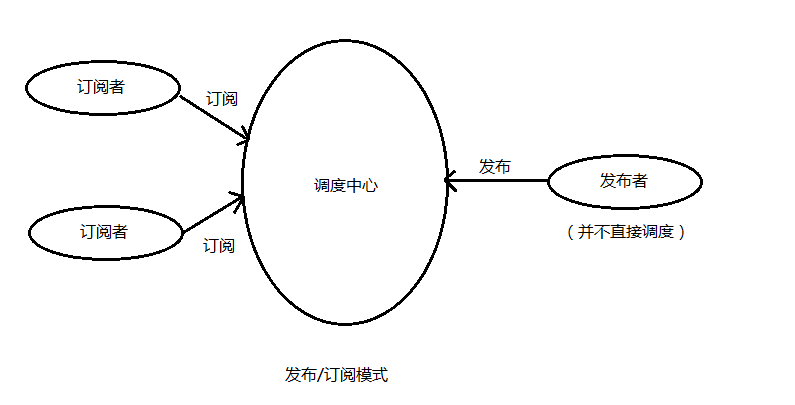

> 发布-订阅模式里面包含了三个模块，发布者，订阅者和处理中心。这里处理中心相当于报刊办事大厅。发布者相当与某个杂志负责人，他来中心这注册一个的杂志，而订阅者相当于用户，我在中心订阅了这分杂志。每当发布者发布了一期杂志，办事大厅就会通知订阅者来拿新杂志。这样在结合下面的图应该很好理解了。

 

下面用原型方式实现一个发布-订阅模式的类

```javascript
function Pubsub() {
    //存放事件和对应的处理方法
    this.handles = {};
}

Pubsub.prototype = {
    //订阅事件
    on: function (type, handle) {  //传入事件类型type和事件处理handle
        if (!this.handles[type]) this.handles[type] = [];
        this.handles[type].push(handle);
    },

    //发布事件
    emit: function(type, ...params) {
        // let type = Array.prototype.shift.call(arguments); //通过传入参数获取事件类型将arguments转为真数组
        if(!this.handles[type]) return false;
        for (let i = 0; i < this.handles[type].length; i++) {
            let handle = this.handles[type][i];
            // handle.apply(this, arguments); //执行事件
            handle(...params)
        }
    },

    //取消发布
    off: function(type, handle) {
        let handlesArr = this.handles[type];
        if (handlesArr) {
            if (!handle) handlesArr.length = 0;//清空数组
            for (let i = 0; i < handlesArr.length; i++) {
                if (handlesArr[i] === handle) {
                    handlesArr.splice(i, 1);  //从数组中删除
                }
            }
        }
    }
}

let test1 = new Pubsub();
//订阅
test1.on('detail', (...name) => { console.log(...name) }); //observer observer1 observer2
//发布
test1.emit('detail', 'observer','observer1', 'observer2')

let test2 = new Pubsub();
// //订阅
test2.on('detail2', (...name) => { console.log(...name) }); //observer2
// //发布
test2.emit('detail2', 'observer2')
// //取消发布
test2.off('detail2');
// //再次发布
test2.emit('detail2', 'observer3');  //上面取消了订阅所以不打印
```

ES6方式实现一个发布-订阅模式的类

```javascript
class Event {
  constructor () {}
  // 首先定义一个事件容器，用来装事件数组（因为订阅者可以是多个）
  handlers = {}

  // 事件添加方法，参数有事件名和事件方法
  addEventListener (type, handler) {
    // 首先判断handlers内有没有type事件容器，没有则创建一个新数组容器
    if (!(type in this.handlers)) {
      this.handlers[type] = []
    }
    // 将事件存入
    this.handlers[type].push(handler)
  }

  // 触发事件两个参数（事件名，参数）
  dispatchEvent (type, ...params) {
    // 若没有注册该事件则抛出错误
    if (!(type in this.handlers)) {
      return new Error('未注册该事件')
    }
    // 便利触发
    this.handlers[type].forEach(handler => {
      handler(...params)
    })
  }

  // 事件移除参数（事件名，删除的事件，若无第二个参数则删除该事件的订阅和发布）
  removeEventListener (type, handler) {
      // 无效事件抛出
      if (!(type in this.handlers)) {
        return new Error('无效事件')
      }
      if (!handler) {
        // 直接移除事件
        delete this.handlers[type]
      } else {
        const idx = this.handlers[type].findIndex(ele => ele === handler)
        // 抛出异常事件
        if (idx === undefined) {
          return new Error('无该绑定事件')
        }
        // 移除事件
        this.handlers[type].splice(idx, 1)
        if (this.handlers[type].length === 0) {
          delete this.handlers[type]
        }
      }
    }
}

var event = new Event() // 创建event实例
// 定义一个自定义事件:"load"
function load (params) {
  console.log('load', params)
}
event.addEventListener('load', load)
// 再定义一个load事件
function load2 (params) {
  console.log('load2', params)
}
event.addEventListener('load', load2)
// 触发该事件
event.dispatchEvent('load', 'load事件触发')
// 移除load2事件
event.removeEventListener('load', load2)
// 移除所有load事件
event.removeEventListener('load')
```