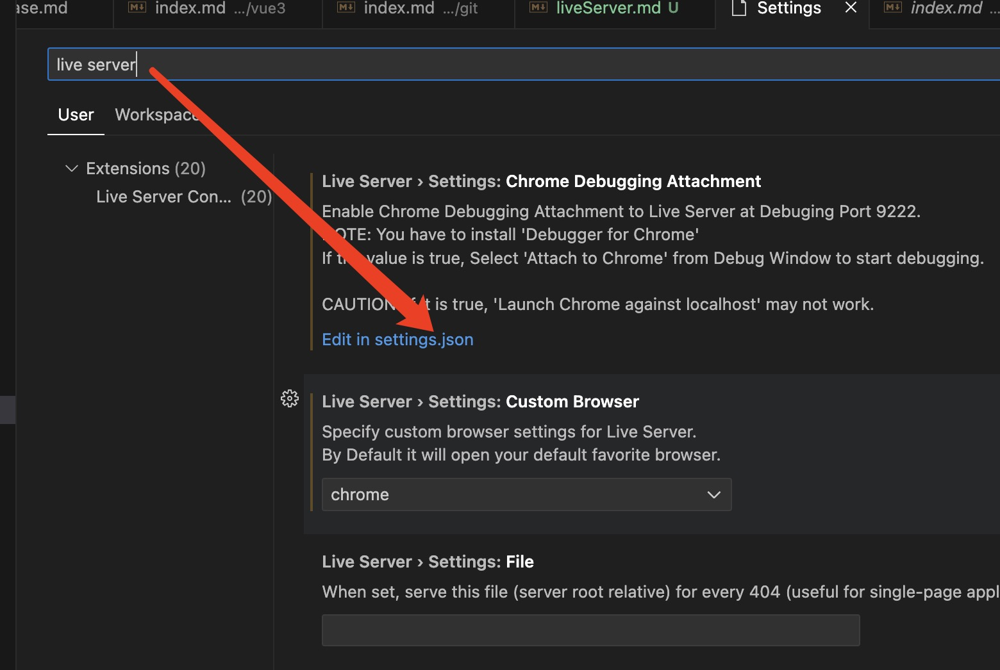
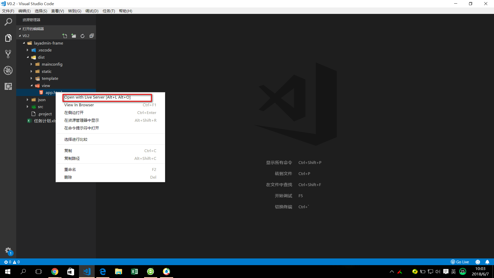

<!--
 * @Author: yanglilong yanglilong@uino.com
 * @Date: 2023-03-01 10:52:20
 * @LastEditors: yanglilong yanglilong@uino.com
 * @LastEditTime: 2023-03-01 10:54:12
 * @FilePath: /blog/docs/frontEndBuild/rollup.md
 * @Description: 这是默认设置,请设置`customMade`, 打开koroFileHeader查看配置 进行设置: https://github.com/OBKoro1/koro1FileHeader/wiki/%E9%85%8D%E7%BD%AE
-->

## Live Server

[官网](https://tapiov.net/live-server/)

> Live Server：一个具有实时加载功能的小型服务器，可以使用它来破解 html/css/javascript，但是不能用于部署最终站点。也就是说我们可以在项目中实时用 live-server 作为一个实时服务器实时查看开发的网页或项目效果。

1. 一键安装，实现自动刷新，架设本地服务器环境。

2. 比起 gulp 构建 实现自动刷新，架设本地服务器环境，需要安装自动刷新插件 gulp-livereload，架设本地服务器插件 gulp-server。Live Server 简直一步到位。只要安装 Live Server，就可以解决自动刷新和架设本地服务器环境的问题。

#### 安装

1. 在 VS Code 扩展中搜索 Live Server，并安装

2. 搜索 Live Server 配置项，更改 Live Server 的配置

```js
{
"liveServer.settings.port": 8080, //设置本地服务的端口号
"liveServer.settings.root": "/", //设置根目录，也就是打开的文件会在该目录下找
"liveServer.settings.CustomBrowser": "chrome", //设置默认打开的浏览器
"liveServer.settings.AdvanceCustomBrowserCmdLine": "chrome --incognito --remote-debugging-port=9222",
"liveServer.settings.NoBrowser": false,
"liveServer.settings.ignoredFiles": [//设置忽略的文件
    ".vscode/**",
    "**/*.scss",
    "**/*.sass"
]
}
```



3. 设置完毕后，重启 vscode，并选择需要浏览的文件，右键开启服务


