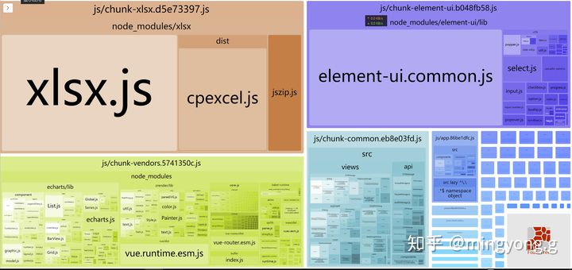
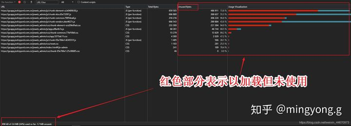

## 首屏优化

Vue 是典型的单页应用，首次加载耗时多，因此优化Vue项目首屏加载对于提升用户体验非常重要。

## 压缩文件体积

1. 压缩图片体积，设置合适的图片尺寸

2. 多图页面采用雪碧图（尤其是小图片）

3. 开启GZIP压缩

    * Vue项目前端配置GZIP，安装CompressionPlugin

    ```javascript

    npm i compression-webpack-plugin -D
    ```

    * 在vue.config.js中进行配置

    >  vue cli3 将webpack配置和vue配置都集中在vue.config.js中管理,这一点需要注意和vue cli2 的区别.如果没有vue.config.js文件可自行在项目「根目录下创建」

    ```javascript
    const CompressionPlugin = require('compression-webpack-plugin');
    const productionGzipExtensions = /\.(js|css|json|txt|html|ico|svg)(\?.*)?$/i;

    /** 开发环境 */
    const DEV = process.env.NODE_ENV !== 'production';

    module.exports = {
        /* vue.config.js支持webpack-chain写法 */
        chainWebpack: config =>{
        /* *******************************************
        *  
        * 开启GZIP压缩
        * 压缩前：4.4MB
        * 压缩后：1.7MB
        * @Author: mingyong.g
        * @Date: 2020-09-02 19:55:13
        * 
        ********************************************/
        if(!DEV){
            config.plugin('compressionPlugin')
            .use( new CompressionPlugin({
            filename: "[path].gz[query]",
            algorithm:"gzip",
            test:productionGzipExtensions,  //所有匹配此{RegExp}的资产都会被处理
            threshold:512,   // 只处理大于此大小的资产。以字节为单位
            minRatio:0.8,    //只有压缩好这个比率的资产才能被处理
            deleteOriginalAssets:false //是否删除原资源
            }))
        }
    }
    ```

    CompressionPlugin的主要配置和说明如上,此外需要特别注意的是deleteOriginalAssets是否删除原资源,这里建议设置为false即压缩资源和原始资源共存,以保证当客户端或者服务端不支持gzip压缩时能够返回原始资源,保障应用正常运行.否则可能出现「404错误」.更多配置请参见[CompressionPlugin中文文档](https://cloud.tencent.com/developer/section/1477554)

    * 服务器开启GZIP压缩 和 nginx服务器下开启gzip压缩

4. 关闭源码视图，清除console.log 日志


## 减少请求次数

1. 使用SplitChunks分离代码并实现相同模块共享,从而减少请求次数

    * 安装BundleAnalyzerPlugin插件生成依赖包可视化分析图谱,帮助开发者分析项目结构

    ```javascript
        npm install --save-dev webpack-bundle-analyzer
    ```

    * vue.config.js中进行BundleAnalyzerPlugin插件配置

    ```javascript
        /** 开发环境 */
        const DEV = process.env.NODE_ENV !== 'production';

        const BundleAnalyzerPlugin = require('webpack-bundle-analyzer').BundleAnalyzerPlugin;

        module.exports = {
            publicPath : './'  // 若要自动生成可视化分析页面,请将publicPath设置为相对路径
            configureWebpack: config => {
            
            /* **********************************************
            *
            * @description webpack 依赖包可视化分析
            * 仅在性能分析的时候启用
            * @Author: mingyong.g
            * @Date: 2020-09-02 21:24:31
            * 
            ***********************************************/
            //if(DEV){
            config.plugins.push(new BundleAnalyzerPlugin())
            //}
            }
        }
    ```

    * 运行npm run build --report 生成分析页面

    ```javascript
        npm run build --report
    ```

    * 配置SplitChunks对注意模块进行分离

    ```javascript
        chainWebpack: config =>{
        if (!DEV) {
            config.optimization.splitChunks({
                cacheGroups: {
                common: {
                    name: 'chunk-common', // 打包后的文件名
                    chunks: 'all', // 
                    minChunks: 2,
                    maxInitialRequests: 5,
                    minSize: 0,
                    priority: 1,
                    reuseExistingChunk: true
                },
                vendors: {
                    name: 'chunk-vendors',
                    test: /[\\/]node_modules[\\/]/,
                    chunks: 'all',
                    priority: 2,
                    reuseExistingChunk: true,
                    enforce: true
                },
                ElementUI: {
                    name: 'chunk-element-ui',
                    test: /[\\/]node_modules[\\/]element-ui[\\/]/,
                    chunks: 'all',
                    priority: 3,
                    reuseExistingChunk: true,
                    enforce: true
            },
            xlsx: {
            name:"chunk-xlsx",
            test: /[\\/]node_modules[\\/]xlsx[\\/]/,
            chunks: 'all',
                    priority: 4,
                    reuseExistingChunk: true,
                    enforce: true
            }
            }
        })
        }
        },
    ```

    再次运行运行npm run build --report 查看结果

2. vue-router使用懒加载

> 作为一个后台管理系统,路由较多使用路由懒加载是优化首屏加载的重要手段.路由懒加载设置比较简单,这里简单提及一下.在router.js文件中，原来的静态引用方式改为以函数的方式动态引入,这样就可以把各自的路由文件分别打包，只有在解析给定的路由时，才会下载路由组件

```javascript
{
    path: '/Login',
    name: 'Login',
    component: () = >import( /* webpackChunkName: "Login" */  '@/view/Login')
}
```

3. 尽量避免组件库,UI库全局注入,最好是按需引用

更细致的优化

本文到这里通过配置gzip / splitChunks / 路由懒加载已经实现了首屏加载10s到2s的性能提升,那么还有没有更进一步的优化空间呢?答案是有的,正如前面所说性能优化是一门很大的学问.以本项目为例,其实仍有很大的优化空间.下面先给出几张性能评估图再分析应该从那些方面着手进一步优化 

* webpack-bundle-analyzer分析图

 

* lighthouse分析图

 

* Coverage分析图

 

「lighthouse分析图」显示当前性能仅35% 而其它项评分都还不错,继续分析 「Coverage分析图」可知再首页加载过程中约66% 的资源未被使用,也就是说可以通过优化这66% 的资源做到更好的首屏加载效果. 「进一步优化主要思路在于减少全局注入」

总结：

1. 尽量避免组件库,UI库全局注入,最好是按需引用

2. 优化暂未使用的文件 首当其冲的就是「webpack-bundle-analyzer分析图」中显示的xlsx.js ,这个文件当时是参考element-admin 引入用于处理excel文件的第三方库,该库本身资源就很大,又由于我将其封装到全局组件中,故而首页加载时将其一并请求到客户端,这里也是一个主要的优化点,随着业务和需求变更,这个第三方库目前来看已经没有存在价值了,后续将考虑将其从代码从剥离,从而实现更好的加载体验.

3. 结合「webpack-bundle-analyzer分析图」 和SplitChunks插件对代码作更细致的拆分 需要注意的减少请求数必然使得单个文件体积变大,二者是矛盾的,最佳实践是取得一个中庸的值平衡优劣.