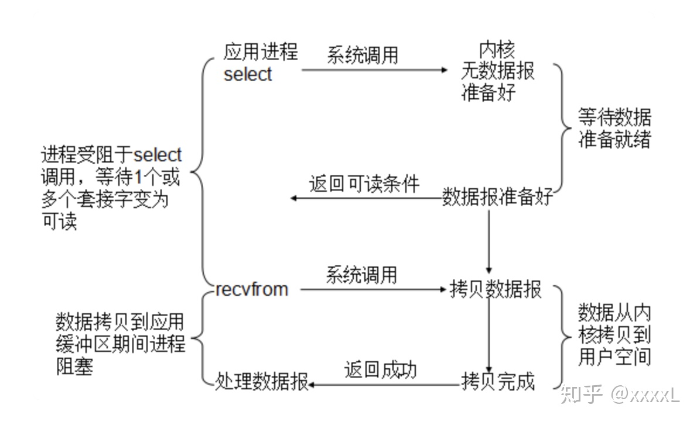

## (g)RPC是什么?

> gRPC = google+ Remote Procedure Call， google出品的远程过程调用（像在本地一样调用远程方法）

屏蔽底层的传输方式（TCP 或者 UDP）、序列化方式（XML/Json/ 二进制）和通信细节

## RPC分类

* 支持多语言的 RPC 框架，比较成熟的有 Google 的 gRPC、Apache（Facebook）的 Thrift；

* 只支持特定语言的 RPC 框架，例如新浪微博的 Motan；

* 支持服务治理等服务化特性的分布式服务框架，其底层内核仍然是 RPC 框架, 例如阿里的 Dubbo。

## 应用场景

内部做模块化拆分之后，如果涉及到不同语言的接口调用，就可以使用gRPC.另外，安卓客户端和后端后台服务做交互，也可以直接使用gRPC

## 特点/优缺点（具体到gRPC）

语言中立，支持多种语言；

* 基于 IDL 文件定义服务，通过 proto3 工具生成指定语言的数据结构、服务端接口以及客户端 Stub；

* 通信协议基于标准的 HTTP/2 设计，支持双向流、消息头压缩、单 TCP 的多路复用、服务端推送等特性，这些特性使得 gRPC 在移动端设备上更加省电和节省网络流量；

* 序列化支持 PB（Protocol Buffer）和 JSON，PB 是一种语言无关的高性能序列化框架，基于 HTTP/2 + PB, 保障了 RPC 调用的高性能。

优点：

* 支持HTTP2 

* 支持多语言 

* 支持安卓移动端

缺点：服务治理相关能力缺失，另外负载均衡和服务发现等功能要业务扩展实现

## 应用流程

#### server创建

1. 创建 Netty HTTP/2 服务端；

2. 将需要调用的服务端接口实现类注册到内部的 Registry 中，RPC 调用时，可以根据 RPC 请求消息中的服务定义信息查询到服务接口实现类；

3. 创建 gRPC Server，它是 gRPC 服务端的抽象，聚合了各种 Listener，用于 RPC 消息的统一调度和处理

#### client创建

1. 客户端 Stub(GreeterBlockingStub) 调用 sayHello(request)，发起 RPC 调用；

2. 通过 DnsNameResolver 进行域名解析，获取服务端的地址信息（列表），随后使用默认的 LoadBalancer 策略，选择一个具体的 gRPC 服务端实例；

3. 如果与路由选中的服务端之间没有可用的连接，则创建 NettyClientTransport 和 NettyClientHandler，发起 HTTP/2 连接；

4. 对请求消息使用 PB（Protobuf）做序列化，通过 HTTP/2 Stream 发送给 gRPC 服务端；

5. 接收到服务端响应之后，使用 PB（Protobuf）做反序列化；

6. 回调 GrpcFuture 的 set(Response) 方法，唤醒阻塞的客户端调用线程，获取 RPC 响应。

#### server调用

> gRPC 的客户端请求消息由 Netty Http2ConnectionHandler 接入，由 gRPC 负责将 PB 消息（或者 JSON）反序列化为 POJO 对象，然后通过服务定义查询到该消息对应的接口实例，发起本地 Java 接口调用，调用完成之后，将响应消息序列化为 PB（或者 JSON），通过 HTTP2 Frame 发送给客户端

1. gRPC 请求消息接入；

2. gRPC 消息头和消息体处理；

3. 内部的服务路由和调用；

4. 响应消息发送。

## 线程模型

> Java NIO之前，socket采用同步阻塞模式（BIO），简单效率低。NIO通过实现Pipe、Channel、Buffer 和 Selector改进为异步非阻塞模式

影响 RPC 框架性能的三个核心要素如下：

1. I/O 模型：用什么样的通道将数据发送给对方，BIO、NIO 或者 AIO，IO 模型在很大程度上决定了框架的性能；

2. 协议：采用什么样的通信协议，Rest+ JSON 或者基于 TCP 的私有二进制协议，协议的选择不同，性能模型也不同，相比于公有协议，内部私有二进制协议的性能通常可以被设计的更优；

3. 线程：数据报如何读取？读取之后的编解码在哪个线程进行，编解码后的消息如何派发，通信线程模型的不同，对性能的影响也非常大。