#### 1、简述ajax请求过程，以及注意事项？

```javascript
// ajax 提交 post 请求的数据
// 1. 创建核心对象
var xhr = new XMLHttpRequest();
// 2. 准备建立连接
xhr.open("POST", "register.php", true);
// 3. 发送请求
// 如果要POST提交数据，则需要设置请求头
xhr.setRequestHeader("Content-Type", "application/x-www-form-urlencoded");
// 发送数据
xhr.send(querystring);
// 4. 处理响应
xhr.onreadystatechange = function () {
     if (xhr.readyState === 4) { // 请求处理完毕，响应就绪
          if (xhr.status === 200) { // 请求成功
               var data = xhr.responseText;
               console.log(data);
          }
     }
}
注意一：open 的参数要牢记
method, url, async: true（异步）或 false（同步）
async: true表示脚本会在 send() 方法之后继续执行，而不等待来自服务器的响应
注意二：post请求不同于get请求
send(string)方法post请求时才使用字符串参数，否则不用带参数。
如果是get直接将参数存入url里面，send() 里面不带参数
注意三：post请求一定要设置请求头的格式内容
```

#### 2、怎么判断一个object是否是数组(array)？
```javascript
let obj = [1,2,3];
// 1.instanceof操作符可以来表示实例是否属于某个构造函数创建的。
obj instanceof Array //true

//2.使用原型对象判断
Array.prototype.isPrototypeOf(obj) //true

//3.根据对象的class属性来判断----推荐
// class：每个对象的内部属性，记录创建对象时使用的类型名，一旦创建，无法修改。
// 问题：数组类型等内置类型，重写了toString方法，直接调用数组对象的方法，不在返回class
// 解决：使用call替换this为指定对象调用Object原型上的toString方法即可。
Object.prototype.toString.call(obj) === "[object Array]" //true

//4.constructor 属性返回对创建此对象的数组函数的引用，就是返回对象相对应的构造函数
obj.constructor === Array //true

// 5.Array.isArray直接判断
Array. isArray(obj) //true
```

#### 3、如何阻止事件冒泡和默认事件?
```javascript
// 阻止冒泡
event.stopPropagation  ? event.stopPropagation()  : event.cancelBubble  =  true

// 阻止默认事件
event.preventDefault  ? event.preventDefault()  : event.returnValue  =  false
```

#### 4、例举3种强制类型转换和2种隐式类型转换?
```javascript
// 强制
String()，Boolean()  Number(）parseInt()  parseFloat() 

// 隐式
+  -  == 
```

#### 5、mvc,mvp和mvvm模式区别?

> MVC和MVVM其实区别并不是很大，都是一种设计思想。

* MVC

  * View 传送指令到 Controller

  * Controller 完成业务逻辑后，要求 Model 改变状态
  
  * Model 将新的数据发送到 View，用户得到反馈
  
  * 所有通信都是单向的（逆时针）。

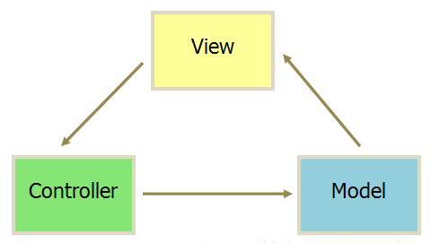 

> MVP 模式将 Controller 改名为 Presenter，同时改变了通信方向。

* MVP

  * 各部分之间的通信，都是双向的（顺时针）。

  * View 与 Model 不发生联系，都通过 Presenter 传递。
  
  * View 非常薄，不部署任何业务逻辑，称为 "被动视图"（Passive View），即没有任何主动性，而 Presenter非常厚，所有逻辑都部署在那里。

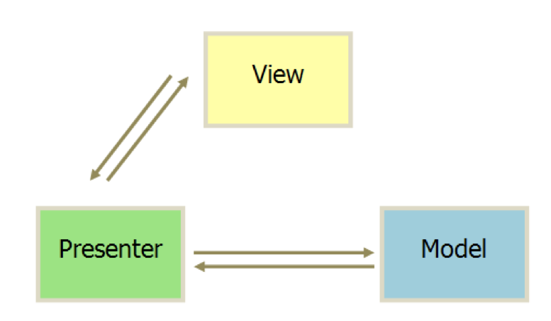 

* mvvm

> MVVM 模式将 Presenter 改名为 ViewModel，基本上与 MVP 模式完全一致。

  * MVVM包括view视图层、model数据层、viewmodel层。各部分通信都是双向的。

  * 采用双向数据绑定，View的变动，自动反映在 ViewModel，反之亦然。
  
  * mvvm代表框架：Angularjs、React、Vue.
  
  * mvvm主要解决了mvc中大量 dom操作使得页面渲染性能降低，加载速度变慢，影响用户体验
  
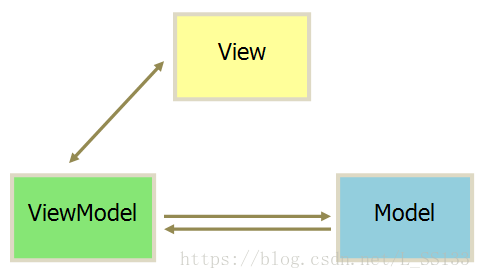 

#### 6、JS的"多线程"?

##### 线程和进程？

> 进程是资源分配的最小单位，线程是CPU调度的最小单位

> 通俗易懂：进程=火车，线程=火车车厢

* 浏览器中的JS是单线程的。

* setInterval和setTimeout并不是多线程，这两个函数根本上其实是事件触发函数

浏览器中有三个常驻的线程，分别是JS引擎，界面渲染，事件响应。由于这三个线程同时要访问DOM树，所以为了线程安全，浏览器内部需要做互斥：当JS引擎在执行代码的时候，界面渲染和事件响应两个线程是被暂停的。所以当JS出现死循环，浏览器无法响应点击，也无法更新界面。现在的浏览器的JS引擎都是单线程的，尽管多线程功能强大，但是线程同步比较复杂，并且危险，稍有不慎就会崩溃死锁。单线程的好处不必考虑线程同步这样的复杂问题，简单而安全。

JS引擎基于事件来执行代码。事件响应线程在接到事件后，把响应的代码放到JS引擎的队列中，JS引擎按顺序执行代码。在JS引擎没有代码可以执行的时候，事件线程和渲染线程得以有机会运行。基于这些信息，能够的出下面的结论:

1. setTimeout，setInterval并不是多线程，只是一个定时的事件触发器，它们在合适的时间把一些JS代码塞到JS引擎的队列中。

2. setTimeout(aFunction, 0)，这行代码看似的意思是在0秒之后执行aFunction, 但这并不意味着立即执行。其它真正的意思是立刻把aFunction的代码放到当前JS引擎的队列中。所以当前代码块执行完成之前，aFunction的代码是得不到执行的。比如这段代码，一定是world先出来，hello后出来。尽管setTimeout的参数是0，但这并不意味着立即执行

```javascript
setTimeout(function() {  
    alert("hello");  
}, 0)  
alert("world")  
```

3. 在一个事件的响应代码执行完成之后，即使队列中有待执行的代码，浏览器也会先执行页面渲染和响应事件，完成之后再执行队列中的代码。

* 异步Ajax

事实上异步Ajax确实用了多线程，只是Ajax请求的Http连接部分由浏览器另外开了一个线程执行，执行完毕之后给JS引擎发送一个事件，这时候异步请求的回调代码得以执行。它的执行流程是这样的：

> Http请求的执行在另外一个线程中，由于这个线程并不会操作DOM树，所以是可以保证线程安全的。发起Ajax请求和回调函数中间是没有JS执行的，所以页面不会卡死。

* 真正的多线程JS

> 在HTML5中，引入了Web Worker这个概念。它能够在另外一个线程中执行计算密集的JS代码而不引起页面卡死，这是真正的多线程。然而为了保证线程安全，Worker中的代码是不能访问DOM的。其具体使用方法在此不作赘述

* <font color=#42b983>总结</font>

> 1. 避免编写计算密集的前端代码。
> 2. 使用异步Ajax。
> 3. 避免编写一个需要较长时间来执行的JS代码，比如生成一个大型的表。遇到这种情况，可以分批执行，比如用setInterval来每秒生成20行，或是用户向下拖动滚动条时候再继续产生新的行。
> 4. 在页面初始化时候不要执行很多的初始化代码，否则会影响页面渲染变慢。一些不需要立即执行的代码可以在页面渲染完成之后再执行，比如绑定事件，生成菜单之类的控件。
> 5. 对于复杂页面（像淘宝首页），可以结合异步Ajax分批产生页面。先生成页面框架，页面内容自上而下用异步Ajax逐步加载并填充到框架中。这样能够让用户更早的看到页面。
> 6. setTimeout(function, 0)是有用的。它可以让callback作为另外一个事件响应代码来执行。实现了当前事件的代码执行完成之后，再渲染DOM，再执行setTimeout的callback。这样能够让一部分代码延后执行，并且在这之前渲染DOM。

#### 7、JS中的宏任务与微任务?

JS中任务类型分为两种：宏任务与微任务。宏任务与微任务各自维护着一个消息队列。

> 宏任务，macrotask，又称为task，可以理解为每次执行栈执行的代码就是一个宏任务（包括每次从事件队列中获取一个事件回调并放到执行栈中执行）。包括：

```javascript
script(整个代码块)，
I/O，
xhr，
setTimeout，
setInterval，
setImmediate（仅Node），
requestAnimationFrame（仅浏览器），
UI交互事件, 
postMessage, 
MessageChannel
```

> 微任务，microtask，又称为job，可以理解是在当前 task 执行结束后立即执行的任务。
包括：

```javascript
Promise.then catch finally， 
await后面代码，
process.nextTick（仅Node），
MutationObserver（仅浏览器）
```

注意：<font color=#42b983>new Promise在实例化的过程中所执行的代码都是同步进行的，而then中注册的回调才是异步执行的。
async/await底层是基于Promise封装的，所以await前面的代码相当于new Promise，是同步进行的，await后面的代码相当于then，才是异步进行的。</font>

为了更好地理解宏任务与微任务，我们将<font color=#42b983>事件循环比喻成银行柜台办理业务。每一个排队办业务的人理解为宏任务，而他除了主要业务外，还有一些零碎的其它业务，比如
咨询等，理解为微任务。</font>

#### 8、JS的事件循环——event loop?
[MDN](https://developer.mozilla.org/zh-CN/docs/Web/JavaScript/EventLoop)
#### 运行机制

Event Loop：JavaScript是单线程脚本语言，同一时间不能处理多个任务，所以何时执行宏任务，何时执行微任务？我们需要有这样的一个判断逻辑存在。这个判断逻辑被称为事件循环。

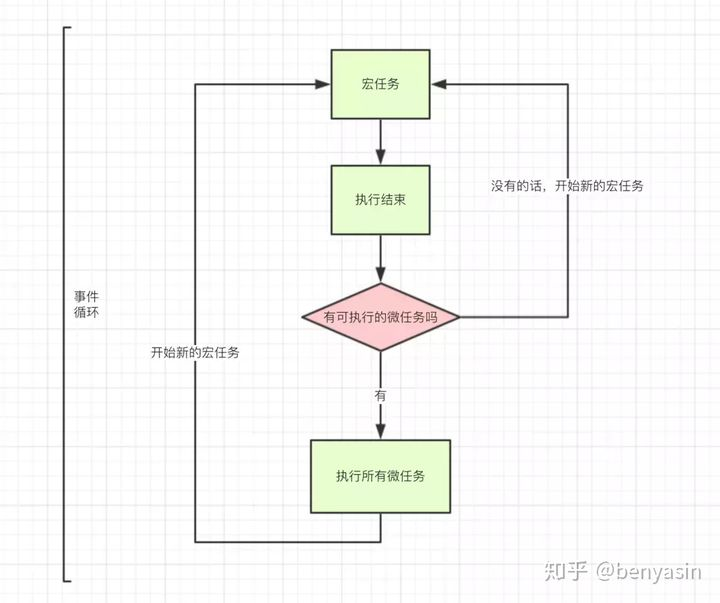 

事件循环的过程如下：

1. JS引擎（唯一主线程）按顺序解析代码，遇到函数声明，直接跳过，遇到函数调用，入栈；

2. 如果是同步函数调用，直接执行得到结果，同步函数弹出栈，继续下一个函数调用；

3. 如果是异步函数调用，分发给Web API（多个辅助线程），异步函数弹出栈，继续下一个函数调用；

4. Web API中，异步函数在相应辅助线程中处理完成后，即异步函数达到触发条件了（比如setTimeout设置的10s后），如果异步函数是宏任务，则入宏任务消息队列，如果是微任务，则入微任务消息队列；

5. Event Loop不停地检查主线程的调用栈与回调队列，当调用栈空时，就把微任务消息队列中的第一个任务推入栈中执行，执行完成后，再取第二个微任务，直到微任务消息队列为空；然后
去宏任务消息队列中取第一个宏任务推入栈中执行，当该宏任务执行完成后，在下一个宏任务执行前，再依次取出微任务消息队列中的所有微任务入栈执行。

6. 上述过程不断循环，每当微任务队列清空，可作为本轮事件循环的结束。

有几个关键点如下：

     1. 所有微任务总会在下一个宏任务之前全部执行完毕，宏任务必然是在微任务之后才执行的（因为微任务实际上是宏任务的其中一个步骤）。
     2. 宏任务按顺序执行，且浏览器在每个宏任务之间渲染页面
     3. 所有微任务也按顺序执行，且在以下场景会立即执行所有微任务
          * 每个回调之后且js执行栈中为空。
          * 每个宏任务结束后。

#### Node中事件循环

关于Node详细内容会在后面篇章中专门讲解，这里只作简单介绍。
Node用V8作为js的解析引擎，而I/O处理方面使用了自己设计的libuv，libuv是一个基于事件驱动的跨平台抽象层，封装了不同操作系统一些底层特性，对外提供统一的API，事件循环机制也是它里面的实现。

<font color=#42b983>Node也是单线程，但是在处理Event Loop上与浏览器稍微有些不同。</font>

> setImmediate为一次Event Loop执行完毕后立刻调用。
> setTimeout则是通过计算一个延迟时间后进行执行。

```javascript
所以如下示例，不能保证输出顺序。

setTimeout(_ => console.log('setTimeout'))
setImmediate(_ => console.log('setImmediate'))

而如果是下面这样，则一定是setImmediate先输出。

setTimeout(_ => console.log('setTimeout'), 20)
setImmediate(_ => console.log('setImmediate'))
```

**process.nextTick**方法可以在当前"执行栈"的尾部----下一次Event Loop（主线程读取"任务队列"）之前----触发回调函数。也就是说，它指定的任务总是发生在所有异步任务之前。
process.nextTick和setImmediate的一个重要区别：多个process.nextTick语句总是在当前"执行栈"一次执行完，多个setImmediate可能则需要多次loop才能执行完。
事实上，这正是Node.js 10.0版添加setImmediate方法的原因，否则像下面这样的递归调用process.nextTick，将会没完没了，主线程根本不会去读取"事件队列"！

```javascript
process.nextTick(function foo() {
  process.nextTick(foo);
});
```

#### 总结

> 搭配上数据结构来讲会更容易理解，任务队列是先进先出的结构，可以用js中的数组来类比，一个宏任务数组一个微任务数组，每次从上到下执行同步代码的时候，如果遇到宏任务的字段，比如setTimeout等，就推入宏任务队列；同理，微任务则推入微任务队列。当同步代码执行完，先查看当前的微任务数组是否为空，如果不为空，则遍历取出执行，直到该队列为空，清空微任务队列后，再遍历宏任务队列取出执行。

[参考](https://zhuanlan.zhihu.com/p/136366037)

#### 9.TCP/IP四层模型？（网络分层架构）
> TCP/IP 分为四层，在发送数据时，每层都要对数据进行封装：

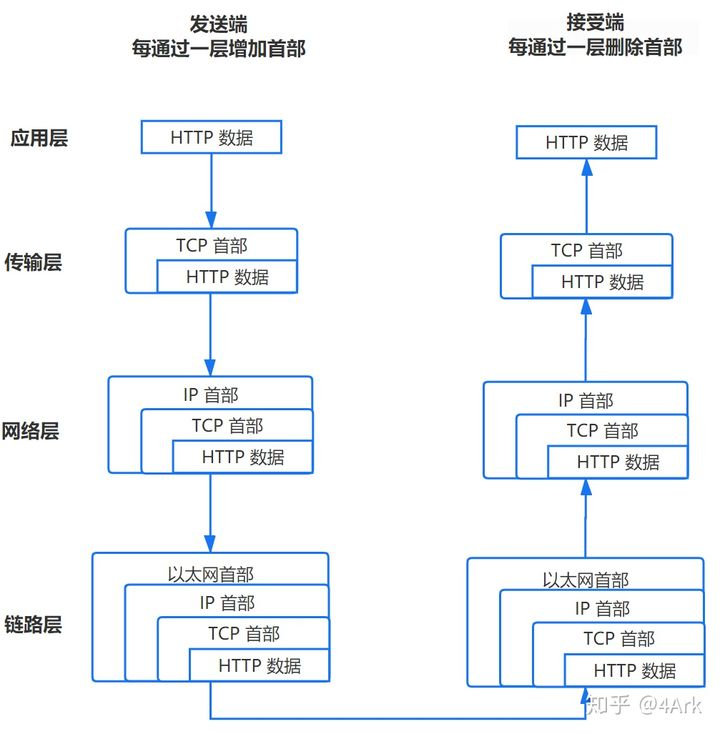

* 应用层：发送 HTTP 请求

> 请求报头（Request Header）：请求方法、目标地址、遵循的协议等等,请求主体（其他参数）

* 传输层：TCP 传输报文

> 传输层会发起一条到达服务器的 TCP 连接，为了方便传输，会对数据进行分割（以报文段为单位），并标记编号，方便服务器接受时能够准确地还原报文信息。在建立连接前，会先进行 TCP 三次握手。

* 网络层：IP协议查询Mac地址

> 将数据段打包，并加入源及目标的IP地址，并且负责寻找传输路线。判断目标地址是否与当前地址处于同一网络中，是的话直接根据 Mac 地址发送，否则使用路由表查找下一跳地址，以及使用 ARP 协议查询它的 Mac 地址。

* 链路层：以太网协议

> 根据以太网协议将数据分为以“帧”为单位的数据包,以太网规定了连入网络的所有设备都必须具备“网卡”接口，数据包都是从一块网卡传递到另一块网卡，网卡的地址就是 Mac 地址。每一个 Mac 地址都是独一无二的，具备了一对一的能力。发送数据的方法很原始，直接把数据通过 ARP 协议，向本网络的所有机器发送，接收方根据标头信息与自身 Mac 地址比较，一致就接受，否则丢弃。然后是服务器接受请求,接受过程就是把以上步骤逆转过来。

#### 10.从 URL 输入到页面展现到底发生什么？

* <font color=red>URL 解析</font>

> 地址解析(输入是否正确，自动完成编码等)，HSTS（由于安全隐患，会使用 HSTS 强制客户端使用 HTTPS 访问页面），
> 其他操作，检查缓存（见下一题）

* <font color=red>DNS 解析: 将域名解析成 IP 地址</font>

> 从各级缓存逐级查找：浏览器缓存，操作系统缓存，路由器缓存，ISP DNS 缓存，根域名服务器查询

* <font color=red>TCP 连接：TCP 三次握手</font>
  * 客户端发送一个带 SYN=1，Seq=X 的数据包到服务器端口（第一次握手，由浏览器发起，告诉服务器我要发送请求了）
  * 服务器发回一个带 SYN=1， ACK=X+1， Seq=Y 的响应包以示传达确认信息（第二次握手，由服务器发起，告诉浏览器我准备接受了，你赶紧发送吧）
  * 客户端再回传一个带 ACK=Y+1， Seq=Z 的数据包，代表“握手结束”（第三次握手，由浏览器发送，告诉服务器，我马上就发了，准备接受吧）
  * 三次握手”的目的是“为了防止已失效的连接请求报文段突然又传送到了服务端，因而产生错误”。

* <font color=red>发送 HTTP 请求</font>

> TCP 三次握手结束后，开始发送 HTTP 请求报文。若请求协议是 HTTPS，还需要建立 TLS(安全传输层协议) 连接。
> 请求报文由请求行（request line）、请求头（header）、请求体三个部分组成,如下图所示：

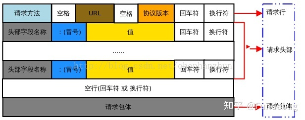

* <font color=red>服务器处理请求并返回 HTTP 报文</font>

* <font color=red>接受响应</font>

> 浏览器接收到来自服务器的响应资源后，会对资源进行分析。首先查看 Response header，根据不同状态码做不同的事（比如上面提到的重定向,若返回的状态时是 301 或 302，则浏览器需要重定向到其他 URL，一切从头开始。）。如果响应资源进行了压缩（比如 gzip），还需要进行解压。然后，对响应资源做缓存。接下来，根据响应资源里的 MIME 类型去解析响应内容（比如 HTML、Image各有不同的解析方式）。浏览器根据响应头中的Content-Type字段判断响应体的数据类型；若是application/octet-stream字节流类型，浏览器会按下载类型来处理，该请求会被提交给浏览器的下载管理器，流程结束。若是 HTML，则进入下个流程：准备渲染进程

* <font color=red>渲染页面</font>

  * 根据 HTML 解析出 DOM 树
  * 根据 CSS 解析生成 CSS 规则树
  * 结合 DOM 树和 CSS 规则树，生成渲染树
  * 根据渲染树计算每一个节点的信息
  * 根据计算好的信息绘制页面

* <font color=red>断开连接：TCP 四次挥手</font>
  
     >当数据传送完毕，需要断开 tcp 连接，此时发起 tcp 四次挥手。
  * 发起方向被动方发送报文，Fin、Ack、Seq，表示已经没有数据传输了。并进入 FIN_WAIT_1 状态。(第一次挥手：由浏览器发起的，发送给服务器，我请求报文发送完了，你准备关闭吧)
  * 被动方发送报文，Ack、Seq，表示同意关闭请求。此时主机发起方进入 FIN_WAIT_2 状态。(第二次挥手：由服务器发起的，告诉浏览器，我请求报文接受完了，我准备关闭了，你也准备吧)
  * 被动方向发起方发送报文段，Fin、Ack、Seq，请求关闭连接。并进入 LAST_ACK 状态。(第三次挥手：由服务器发起，告诉浏览器，我响应报文发送完了，你准备关闭吧)
  * 发起方向被动方发送报文段，Ack、Seq。然后进入等待 TIME_WAIT 状态。被动方收到发起方的报文段以后关闭连接。发起方等待一定时间未收到回复，则正常关闭。(第四次挥手：由浏览器发起，告诉服务器，我响应报文接受完了，我准备关闭了，你也准备吧)

[参考1](https://zhuanlan.zhihu.com/p/80551769) / 
[参考2](https://zhuanlan.zhihu.com/p/57895541)

#### 11.浏览器怎么渲染页面的？
  * 根据 HTML 解析出 DOM 树
  * 根据 CSS 解析生成 CSS 规则树
  * 结合 DOM 树和 CSS 规则树，生成渲染树
  * 根据渲染树计算每一个节点的信息
  * 根据计算好的信息绘制页面

详情[参考](https://zhuanlan.zhihu.com/p/80551769)

#### 12.浏览器怎么检测缓存？

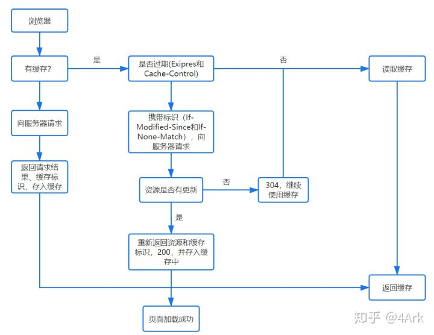

#### 13.能不能说一说浏览器的本地存储？各自优劣如何？

> 浏览器的本地存储主要分为Cookie、WebStorage和IndexedDB, 
其中WebStorage又可以分为localStorage和sessionStorage。

##### Cookie

Cookie 最开始被设计出来其实并不是来做本地存储的，而是为了弥补HTTP在状态管理上的不足。
HTTP 协议是一个无状态协议，客户端向服务器发请求，服务器返回响应，下次发请求如何让服务端知道客户端是谁呢？这种背景下，就产生了 Cookie.
	
Cookie 本质上就是浏览器里面存储的一个很小的文本文件，内部以键值对的方式来存储(在chrome开发者面板的Application这一栏可以看到)。
向同一个域名下发送请求，都会携带相同的 Cookie，服务器拿到 Cookie 进行解析，便能拿到客户端的状态。

Cookie 的缺点

1. 容量缺陷。Cookie 的体积上限只有4KB，只能用来存储少量的信息。
2. 性能缺陷。Cookie 紧跟域名，不管域名下面的某一个地址需不需要这个 Cookie ，请求都会携带上完整的 Cookie，这样随着请求数的增多，其实会造成巨大的性能浪费的，因为请求携带了很多不必要的内容
3. 安全缺陷。由于 Cookie 以纯文本的形式在浏览器和服务器中传递，很容易被非法用户截获，然后进行一系列的篡改，在 Cookie 的有效期内重新发送给服务器，这是相当危险的。另外，在HttpOnly为 false 的情况下，Cookie 信息能直接通过 JS 脚本来读取。

##### localStorage 和Cookie异同

localStorage有一点跟Cookie一样，就是针对一个域名，即在同一个域名下，会存储相同的一段localStorage。

不过它相对Cookie还是有相当多的区别的:
1. 容量。localStorage 的容量上限为5M，相比于Cookie的 4K 大大增加。当然这个 5M 是针对一个域名的，因此对于一个域名是持久存储的。
2. 只存在客户端，默认不参与与服务端的通信。这样就很好地避免了 Cookie 带来的性能问题和安全问题。
3. 接口封装。通过localStorage暴露在全局，并通过它的 setItem 和 getItem等方法进行操作，非常方便。

##### sessionStorage 和使用场景

sessionStorage以下方面和localStorage一致:
1. 容量。容量上限也为 5M。
2. 只存在客户端，默认不参与与服务端的通信。
3. 接口封装。除了sessionStorage名字有所变化，存储方式、操作方式均和localStorage一样。
	但sessionStorage和localStorage有一个本质的区别，那就是前者只是会话级别的存储，并不是持久化存储。
	会话结束，也就是页面关闭，这部分sessionStorage就不复存在了。

应用场景

可以用它对表单信息进行维护，将表单信息存储在里面，可以保证页面即使刷新也不会让之前的表单信息丢失。
可以用它存储本次浏览记录。如果关闭页面后不需要这些记录，用sessionStorage就再合适不过了。
事实上微博就采取了这样的存储方式。

##### IndexedDB

IndexedDB是运行在浏览器中的非关系型数据库, 本质上是数据库，绝不是和刚才WebStorage的 5M 一个量级，理论上这个容量是没有上限的。

关于它的使用，本文侧重原理，而且 MDN 上的教程文档已经非常详尽，这里就不做赘述了，感兴趣可以看一下使用文档。
	
接着我们来分析一下IndexedDB的一些重要特性，除了拥有数据库本身的特性，
比如支持事务，存储二进制数据，还有这样一些特性需要格外注意：
1. 键值对存储。内部采用对象仓库存放数据，在这个对象仓库中数据采用键值对的方式来存储。
2. 异步操作。数据库的读写属于 I/O 操作, 浏览器中对异步 I/O 提供了支持。
3. 受同源策略限制，即无法访问跨域的数据库。


**总结**

浏览器中各种本地存储和缓存技术的发展，给前端应用带来了大量的机会，
PWA 也正是依托了这些优秀的存储方案才得以发展起来。
重新梳理一下这些本地存储方案:
1. cookie并不适合存储，而且存在非常多的缺陷。
2. Web Storage包括localStorage和sessionStorage, 默认不会参与和服务器的通信。
3. IndexedDB为运行在浏览器上的非关系型数据库，为大型数据的存储提供了接口。

#### 14.常见兼容性问题？

```javascript
1. 事件对象兼容
e  = e || window.event;

2. 阻止事件冒泡兼容
event.stopPropagation? event.stopPropagation():event.cancelBubble=true;

3. 阻止默认行为兼容
evt.preventDefault?evt.preventDefault():evt.returnValue=false;

4. 事件监听兼容
addEventListener  ? addEventListener  : attachEvent()
removeEventListener() ? removeEventListener() : detachEvent()

5. 事件目标对象兼容
var src = event.target || event.srcElement;
```

#### 15.setTimeout、Promise、Async / Await 的区别?

首先，我们先来了解一下基本概念：
js EventLoop 事件循环机制:
JavaScript的事件分两种，宏任务(macro-task)和微任务(micro-task)

宏任务：包括整体代码script，setTimeout，setInterval
微任务：Promise.then(非new Promise)，process.nextTick(node中)

事件的执行顺序，是先执行宏任务，然后执行微任务，这个是基础，任务可以有同步任务和异步任务，同步的进入主线程，异步的进入Event Table并注册函数，异步事件完成后，会将回调函数放入Event Queue中(宏任务和微任务是不同的Event Queue)，同步任务执行完成后，会从Event Queue中读取事件放入主线程执行，回调函数中可能还会包含不同的任务，因此会循环执行上述操作。
注意： setTimeOut并不是直接的把你的回掉函数放进上述的异步队列中去，而是在定时器的时间到了之后，把回掉函数放到执行异步队列中去。如果此时这个队列已经有很多任务了，那就排在他们的后面。这也就解释了为什么setTimeOut为什么不能精准的执行的问题了。setTimeOut执行需要满足两个条件：

1. 主进程必须是空闲的状态，如果到时间了，主进程不空闲也不会执行你的回掉函数 
2. 这个回掉函数需要等到插入异步队列时前面的异步函数都执行完了，才会执行 

上面是比较官方的解释，说一下自己的理解吧：

了解了什么是宏任务和微任务，就好理解多了，首先执行 宏任务 => 微任务的Event Queue => 宏任务的Event Queue

promise、async/await
首先，new Promise是同步的任务，会被放到主进程中去立即执行。而.then()函数是异步任务会放到异步队列中去，那什么时候放到异步队列中去呢？当你的promise状态结束的时候，就会立即放进异步队列中去了。

带async关键字的函数会返回一个promise对象，如果里面没有await，执行起来等同于普通函数；如果没有await，async函数并没有很厉害是不是
await 关键字要在 async 关键字函数的内部，await 写在外面会报错；await如同他的语意，就是在等待，等待右侧的表达式完成。此时的await会让出线程，阻塞async内后续的代码，先去执行async外的代码。等外面的同步代码执行完毕，才会执行里面的后续代码。就算await的不是promise对象，是一个同步函数，也会等这样操作
步入正题：

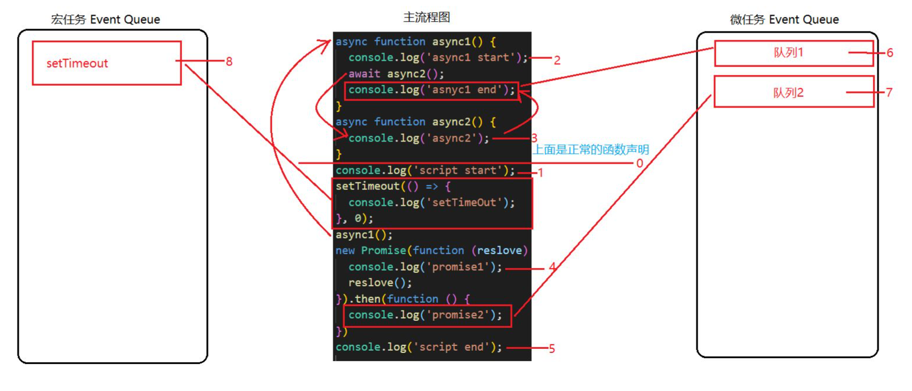

```javascript
根据图片显示我们来整理一下流程：

1、执行console.log('script start')，输出script start；
2、执行setTimeout，是一个异步动作，放入宏任务异步队列中；
3、执行async1()，输出async1 start，继续向下执行；
4、执行async2()，输出async2，并返回了一个promise对象，await让出了线程，把返回的promise加入了微任务异步队列，所以async1()下面的代码也要等待上面完成后继续执行;
5、执行 new Promise，输出promise1，然后将resolve放入微任务异步队列；
6、执行console.log('script end')，输出script end；
7、到此同步的代码就都执行完成了，然后去微任务异步队列里去获取任务
8、接下来执行resolve（async2返回的promise返回的），输出了async1 end。
9、然后执行resolve（new Promise的），输出了promise2。
10、最后执行setTimeout，输出了settimeout。
```

#### 15.谈谈你对 TCP 三次握手和四次挥手的理解?

TCP三次握手：

1、客户端发送syn包到服务器，等待服务器确认接收。

2、服务器确认接收syn包并确认客户的syn，并发送回来一个syn+ack的包给客户端。

3、客户端确认接收服务器的syn+ack包，并向服务器发送确认包ack，二者相互建立联系后，完成tcp三次握手。

四次握手就是中间多了一层：等待服务器再一次响应回复相关数据的过程

三次握手之所以是三次是保证client和server均让对方知道自己的接收和发送能力没问题而保证的最小次数。

第一次client => server 只能server判断出client具备发送能力

第二次 server => client client就可以判断出server具备发送和接受能力。此时client还需让server知道自己接收能力没问题于是就有了第三次
第三次 client => server 双方均保证了自己的接收和发送能力没有问题

其中，为了保证后续的握手是为了应答上一个握手，每次握手都会带一个标识 seq，后续的ACK都会对这个seq进行加一来进行确认。

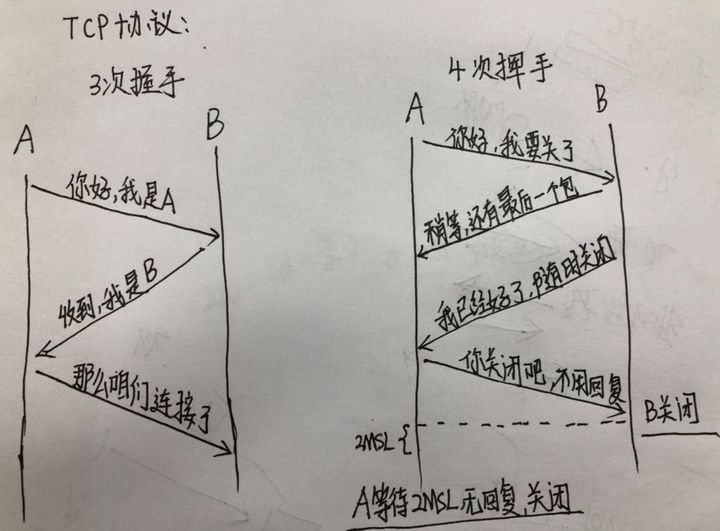

#### 16.介绍下重绘和回流（Repaint & Reflow），以及如何进行优化?

1. 浏览器渲染机制

浏览器采用流式布局模型（Flow Based Layout）
浏览器会把 HTML 解析成 DOM，把 CSS 解析成 CSSOM，DOM 和 CSSOM 合并就
产生了渲染树（Render Tree）。
有了 RenderTree，我们就知道了所有节点的样式，然后计算他们在页面上的大
小和位置，最后把节点绘制到页面上。
由于浏览器使用流式布局，对 Render Tree 的计算通常只需要遍历一次就可以完
成，但 table 及其内部元素除外，他们可能需要多次计算，通常要花 3 倍于同
等元素的时间，这也是为什么要避免使用 table 布局的原因之一。

2. 重绘

由于节点的几何属性发生改变或者由于样式发生改变而不会影响布局的，称为
重绘，例如 outline, visibility, color、background-color 等，重绘的代价是高昂的，
因为浏览器必须验证 DOM 树上其他节点元素的可见性。

3. 回流

回流是布局或者几何属性需要改变就称为回流。回流是影响浏览器性能的关键
因素，因为其变化涉及到部分页面（或是整个页面）的布局更新。一个元素的
回流可能会导致了其所有子元素以及 DOM 中紧随其后的节点、祖先节点元素
的随后的回流。


```html
<body><div class="error">
<h4>我的组件</h4>
<p><strong>错误：</strong>错误的描述…</p>
<h5>错误纠正</h5>
<ol>
<li>第一步</li>
<li>第二步</li>
</ol></div></body>
```

在上面的 HTML 片段中，对该段落(&lt;p&gt;标签)回流将会引发强烈的回流，因为它
是一个子节点。这也导致了祖先的回流（div.error 和 body – 视浏览器而定）。
此外，&lt;h5&gt;和&lt;ol&gt;也会有简单的回流，因为其在 DOM 中在回流元素之后。大部
分的回流将导致页面的重新渲染。

<font color=red>回流必定会发生重绘，重绘不一定会引发回流。</font>

#### 17.cookie 和 token 都存放在 header 中，为什么不会劫持 token？

1. 攻击者通过 xss 拿到用户的 cookie 然后就可以伪造 cookie 了。

2. 或者通过 csrf 在同个浏览器下面通过浏览器会自动带上 cookie 的特性在通过 用户网站-攻击者网站-攻击者请求用户网站的方式 浏览器会自动带上cookie

  但是 token

1. 不会被浏览器带上 问题 2 解决
2. token 是放在 jwt 里面下发给客户端的 而且不一定存储在哪里 不能通过document.cookie 直接拿到，通过 jwt+ip 的方式 可以防止 被劫持 即使被劫持也是无效的 jwt

#### 18.介绍下 webpack 热更新原理，是如何做到在不刷新浏览器的前提下更新页面的?

1. 当修改了一个或多个文件；

2. 文件系统接收更改并通知 webpack；

3. webpack 重新编译构建一个或多个模块，并通知 HMR 服务器进行更新；

4. HMR Server 使用 webSocket 通知 HMR runtime 需要更新，HMR 运行时通过 HTTP 请求更新 jsonp；

5. HMR 运行时替换更新中的模块，如果确定这些模块无法更新，则触发整个页面刷新。

#### 19.js变量与内存之间的关系？

变量与内存之间的关系，主要由三个部分组成：

1. 变量名

2. 内存地址

3. 内存空间

JS 引擎在读取变量时，先找到变量绑定的内存地址，然后找到地址所指向的内
存空间，最后读取其中的内容。当变量改变时，JS 引擎不会用新值覆盖之前旧
值的内存空间（虽然从写代码的角度来看，确实像是被覆盖掉了），而是重新
分配一个新的内存空间来存储新值，并将新的内存地址与变量进行绑定，JS 引
擎会在合适的时机进行 GC，回收旧的内存空间。
const 定义变量（常量）后，变量名与内存地址之间建立了一种不可变的绑定
关系，阻隔变量地址被改变，当 const 定义的变量进行重新赋值时，根据前面
的论述，JS 引擎会尝试重新分配新的内存空间，所以会被拒绝，便会抛出异常。

#### 20.var 、let 和 const 区别的实现原理是什么？

1. var 和 let 用以声明变量，const 用于声明只读的常量；

2. var 声明的变量，不存在块级作用域，let 和 const声明的，存在块级作用域；

3. let 声明的变量存在暂时性死区，即只要块级作用域中存在 let，那么它所声明的变量就绑定了这个区域，不再受外部的影响。let 不允许在相同作用域内，重复声明同一个变量；

4. const 在声明时必须初始化赋值，一旦声明，其声明的值就不允许改变，更不允许重复声明；如 const 声明了一个复合类型的常量，其存储的是一个引用地址，不允许改变的是这个地址，而对象本身是可变的。

#### 21.介绍下前端加密的常见场景和方法？

首先，加密的目的，简而言之就是将明文转换为密文、甚至转换为其他的东西，
用来隐藏明文内容本身，防止其他人直接获取到敏感明文信息、或者提高其他
人获取到明文信息的难度。通常我们提到加密会想到密码加密、HTTPS 等关键
词，这里从场景和方法分别提一些我的个人见解。

**场景-密码传输**

前端密码传输过程中如果不加密，在日志中就可以拿到用户的明文密码，对用
户安全不太负责。这种加密其实相对比较简单，可以使用 PlanA-前端加密、后
端解密后计算密码字符串的 MD5/MD6 存入数据库；也可以 PlanB-直接前端使
用一种稳定算法加密成唯一值、后端直接将加密结果进行 MD5/MD6，全程密
码明文不出现在程序中。

* PlanA 使用 Base64 / Unicode+1 等方式加密成非明文，后端解开之后再存它的
MD5/MD6 。

* PlanB 直接使用 MD5/MD6 之类的方式取 Hash ，让后端存 Hash 的 Hash 。
场景-数据包加密

* 网站内容防爬

#### 22.函数防抖与函数节流？

函数防抖与节流是很相似的概念，但它们的应用场景不太一样。

##### 防抖(debounce)：

> 对于短时间内连续触发的事件，防抖的含义就是让某个时间期限内（约定200毫秒），事情处理函数只执行最后一次的触发。我连续输入10个字母，在输入最后一个字母后，再等200毫秒，执行请求接口。<font color=#42b983>如果在定时器的时间范围内再次触发，则清除前面的重新计时,是一种替换操作。</font>

```javascript
function debounce(fn, wait) {
    let timer = null;
    return function () {
        let arg = arguments; //arguments保存事件回调函数中的参数
        if (timer) {
            clearTimeout(timer);
            timer = null;
        }
        timer = setTimeout(() => {
            fn.apply(this, arg) //使用apply改变传入的fn方法中的this指向，指向绑定事件的DOM元素。
        }, wait)
    }
}
```

**使用场景**

* 提交按钮的点击事件
  
* input的keyup 和 input事件

##### 节流(throttle)：

> 对于短时间内连续触发的事件，节流的含义就是在某个时间期限内每隔（预定300毫秒）执行一次。举个例子：我连续输入10个字母，在输入过程中，每隔300毫秒就请求一次接口。也就是说等输入完10个字母，会请求很多次接口。<font color=#42b983>指定时间内执行一次</font>

```javascript
// 节流：时间比较+定时器____________比较完全实现
// 1、第一次触发时候需要执行
// 2、单位时间内触发只会触发一次、
// 3、最后一次触发、执行一次
function throttle(fn, wait) {
  let timer, startTime = 0;
  var wait = wait || 160;
  return function (...args) {
    const nowDate = Date.now();
    if (nowDate - startTime >= wait) {
      // 执行第一次、以及单位时间内执行一次
      startTime = nowDate;
      fn.apply(this, args);
    } else {
      // 单位时间内多次触发、清除、重新启动
      clearTimeout(timer);
      timer = setTimeout(() => {
        startTime = nowDate;
        // 执行最后一次
        fn.apply(this, args);
      }, wait)
    }
  }
}

//非时间戳实现
function throttle(func, delay) {
  let run = true
  return function () {
    if (!run) {
      return  // 如果开关关闭了，那就直接不执行下边的代码
    }
    run = false // 持续触发的话，run一直是false，就会停在上边的判断那里
    setTimeout(() => {
      func.apply(this, arguments)
      run = true // 定时器到时间之后，会把开关打开，我们的函数就会被执行
    }, delay)
  }
}
```

**使用场景**

* resize, touchmove, mousemove, scroll等比input, keyup更频繁触发的事件中

[参考](https://zhuanlan.zhihu.com/p/72923073)

#### 23.JavaScript 有几种类型的值？你能画一下他们的内存图吗？

基本数据类型：Null、Undefined、Boolean、Number、String、Symbol(es6)、BigInt(es10) 共7种

```javascript
typeof 2n //"bigint"

typeof null //"object"

typeof undefined  //"undefined"
```

引用数据类型：obj（对象、数组和函数）

BigInt 是一种内置对象，它提供了一种方法来表示大于 2^53 - 1 的整数。这原本是 Javascript中可以用Number 表示的最大数字。BigInt 可以表示任意大的整数。

> 两种类型的区别是：存储位置不同。
原始数据类型直接存储在栈（stack）中的简单数据段，占据空间小、大小固定，属于被频繁使用数据，所以放入栈中存储。

> 引用数据类型存储在堆（heap）中的对象，占据空间大、大小不固定。如果存储在栈中，将会影响程序运行的性能；引用数据类型在
栈中存储了指针，该指针指向堆中该实体的起始地址。当解释器寻找引用值时，会首先检索其在栈中的地址，取得地址后从堆中获得实
体。

**原始数据**

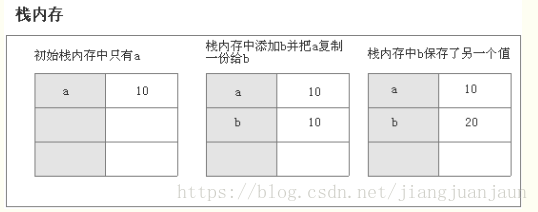 

**引用数据**

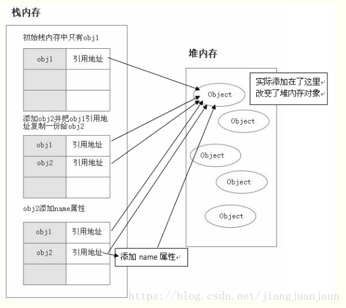 

#### 24.AMD 和 CMD 规范的区别？

它们之间的主要区别有两个方面。

（1）第一个方面是在模块定义时对依赖的处理不同。AMD 推崇依赖前置，在定义模块的时候就要声明其依赖的模块。而 CMD 推崇 就近依赖，只有在用到某个模块的时候再去 require。

（2）第二个方面是对依赖模块的执行时机处理不同。首先 AMD 和 CMD 对于模块的加载方式都是异步加载，不过它们的区别在于 模块的执行时机，AMD 在依赖模块加载完成后就直接执行依赖模块，依赖模块的执行顺序和我们书写的顺序不一定一致。而 CMD 在依赖模块加载完成后并不执行，只是下载而已，等到所有的依赖模块都加载好后，进入回调函数逻辑，遇到 require 语句 的时候才执行对应的模块，这样模块的执行顺序就和我们书写的顺序保持一致了。

```javascript
// CMD
define(function(require, exports, module) {
  var a = require("./a");
  a.doSomething();
  // 此处略去 100 行
  var b = require("./b"); // 依赖可以就近书写
  b.doSomething();
  // ...
});

// AMD 默认推荐
define(["./a", "./b"], function(a, b) {
  // 依赖必须一开始就写好
  a.doSomething();
  // 此处略去 100 行
  b.doSomething();
  // ...
});
```

#### 25.DOM 操作——怎样添加、移除、移动、复制、创建和查找节点？

##### 创建新节点

```javascript
createDocumentFragment(node);
createElement(node);
createTextNode(text);
```

##### 添加、移除、替换、插入

```javascript
appendChild(node)
removeChild(node)
replaceChild(new,old)
insertBefore(new,old)
```
##### 查找

```javascript
getElementById();
getElementsByName();
getElementsByTagName();
getElementsByClassName();
querySelector();
querySelectorAll();
```
##### 属性操作

```javascript
getAttribute(key);
setAttribute(key, value);
hasAttribute(key);
removeAttribute(key);
```

#### 26. JavaScript 类数组对象的定义？

> 一个拥有 length 属性和若干索引属性的对象就可以被称为类数组对象，类数组对象和数组类似，但是不能调用数组的方法。

常见的类数组对象有 arguments 和 DOM 方法的返回结果，还有一个函数也可以被看作是类数组对象，因为它含有 length
属性值，代表可接收的参数个数。

常见的类数组转换为数组的方法有这样几种：

```javascript
（1）通过 call 调用数组的 slice 方法来实现转换

Array.prototype.slice.call(arrayLike);

（2）通过 call 调用数组的 splice 方法来实现转换

Array.prototype.splice.call(arrayLike, 0);

（3）通过 apply 调用数组的 concat 方法来实现转换

Array.prototype.concat.apply([], arrayLike);

（4）通过 Array.from 方法来实现转换

Array.from(arrayLike);
```

#### 27.如何确定页面的可用性时间，什么是 Performance API？

Performance API 用于精确度量、控制、增强浏览器的性能表现。这个 API 为测量网站性能，提供以前没有办法做到的精度。

使用 getTime 来计算脚本耗时的缺点，首先，getTime方法（以及 Date 对象的其他方法）都只能精确到毫秒级别（一秒的千分之一），想要得到更小的时间差别就无能为力了。其次，这种写法只能获取代码运行过程中的时间进度，无法知道一些后台事件的时间进度，比如浏览器用了多少时间从服务器加载网页。

为了解决这两个不足之处，ECMAScript 5引入“高精度时间戳”这个 API，部署在 performance 对象上。它的精度可以达到1毫秒
的千分之一（1秒的百万分之一）。

navigationStart：当前浏览器窗口的前一个网页关闭，发生 unload 事件时的 Unix 毫秒时间戳。如果没有前一个网页，则等于 fetchStart 属性。

loadEventEnd：返回当前网页 load 事件的回调函数运行结束时的 Unix 毫秒时间戳。如果该事件还没有发生，返回 0。

根据上面这些属性，可以计算出网页加载各个阶段的耗时。比如，网页加载整个过程的耗时的计算方法如下：

```javascript
var t = performance.timing;

var pageLoadTime = t.loadEventEnd - t.navigationStart;
```

#### 28. 一个列表，假设有 100000 个数据，这个该怎么办？

我们需要思考的问题：该处理是否必须同步完成？数据是否必须按顺序完成？

解决办法：

1. 将数据分页，利用分页的原理，每次服务器端只返回一定数目的数据，浏览器每次只对一部分进行加载。

2. 使用懒加载的方法，每次加载一部分数据，其余数据当需要使用时再去加载。

3. 使用数组分块技术，基本思路是为要处理的项目创建一个队列，然后设置定时器每过一段时间取出一部分数据，然后再使用定时器取出下一个要处理的项目进行处理，接着再设置另一个定时器。

#### 29.null 和 undefined区别？

null 用来表示尚未存在的对象，常用来表示函数企图返回一个不存在的对象。  null 表示"没有对象"，即该处不应该有值。 null 典型用法是： 

* 作为函数的参数，表示该函数的参数不是对象。 
* 作为对象原型链的终点。

当声明的变量还未被初始化时，变量的默认值为 undefined。 undefined 表示"缺少值"，就是此处应该有一个值，但是还没有定义。

* 变量被声明了，但没有赋值时，就等于 undefined。 
* 调用函数时，应该提供的参数没有提供，该参数等于 undefined。 
* 对象没有赋值的属性，该属性的值为 undefined。 
* 函数没有返回值时，默认返回 undefined。

> 未定义的值和定义未赋值的为 undefined，null 是一种特殊的 object，NaN 是一种特殊的 number。

#### 30.说下对 Virtual DOM 算法的理解 ？

包括几个步骤：

1. 用 JavaScript 对象结构表示 DOM 树的结构，然后用这个树构建一个真正的 DOM 树，插到文档当中；

2. 当状态变更的时候，重新构造一棵新的对象树，然后用新的树和旧的树进行比较，记录两棵树差异；

3. 把 2 所记录的差异应用到步骤 1 所构建的真正的 DOM 树上，视图就更新了。

> Virtual DOM 本质上就是在 JS 和 DOM 之间做了一个缓存。可以类比 CPU 和硬盘，既然硬盘这么慢，我们就在它们之间加个缓存：既然 DOM 这么慢，我们就在它们 JS 和 DOM 之间加个缓存。CPU（JS）只操作内存（Virtual DOM），最后的时候再把变更写入硬盘（DOM）。

##### 比较两棵虚拟 DOM 树的差异

比较两棵 DOM 树的差异是 Virtual DOM 算法最核心的部分，这也是所谓的 Virtual DOM 的 diff 算法。 两个树的完全的 diff 算法是一个时间复杂度为 O(n^3) 的问题。但是在前端当中，你很少会跨越层级地移动 DOM 元素。

所以 Virtual DOM 只会对同一个层级的元素进行对比：

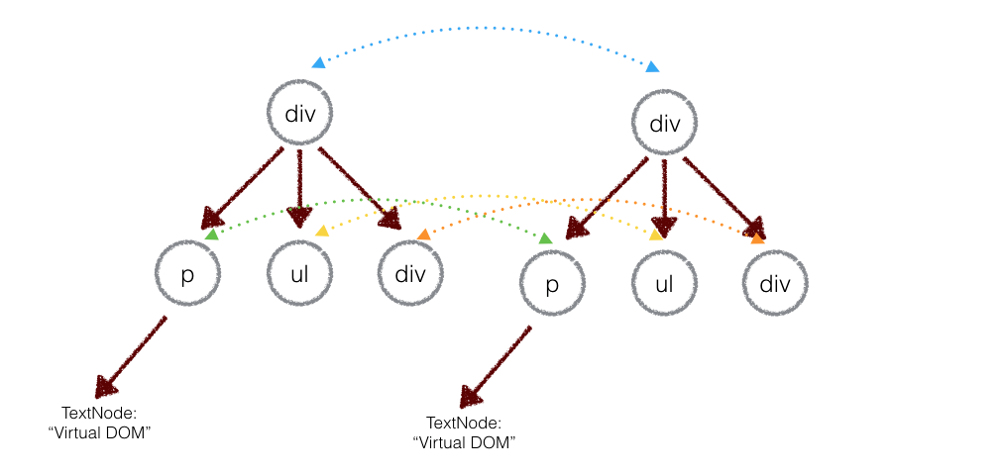

上面的 div 只会和同一层级的 div 对比，第二层级的只会跟第二层级对比。这样算法复杂度就可以达到 O(n)。

深度优先遍历，记录差异

在实际的代码中，会对新旧两棵树进行一个深度优先的遍历，这样每个节点都会有一个唯一的标记：

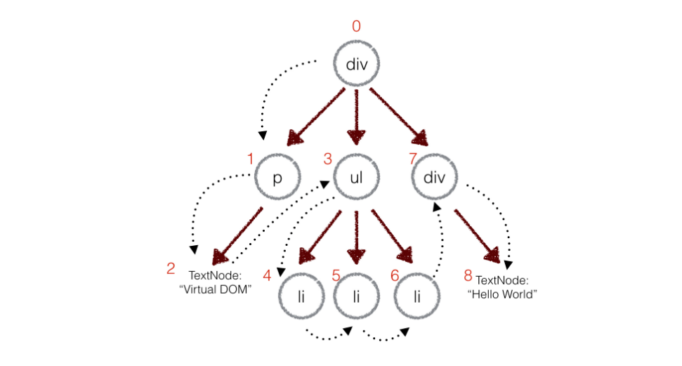

在深度优先遍历的时候，每遍历到一个节点就把该节点和新的的树进行对比。如果有差异的话就记录到一个对象里面。

Virtual DOM 算法主要是实现上面步骤的三个函数：element，diff，patch。然后就可以实际的进行使用：

```javascript
// 1. 构建虚拟 DOM
var tree = el('div', {'id': 'container'}, [
    el('h1', {style: 'color: blue'}, ['simple virtal dom']),
    el('p', ['Hello, virtual-dom']),
    el('ul', [el('li')])
])
// 2. 通过虚拟 DOM 构建真正的 DOM
var root = tree.render()
document.body.appendChild(root)
// 3. 生成新的虚拟 DOM
var newTree = el('div', {'id': 'container'}, [
    el('h1', {style: 'color: red'}, ['simple virtal dom']),
    el('p', ['Hello, virtual-dom']),
    el('ul', [el('li'), el('li')])
])
// 4. 比较两棵虚拟 DOM 树的不同
var patches = diff(tree, newTree)
// 5. 在真正的 DOM 元素上应用变更
patch(root, patches)

```

当然这是非常粗糙的实践，实际中还需要处理事件监听等；生成虚拟 DOM 的时候也可以加入 JSX 语法。这些事情都做了的话，就可以构造一个简单的 ReactJS 了。

#### 31. Vue,React与Angular有何不同？

|  主题	|  React	|  Angular |  Vue    |
|  ----------------  | ----------------  | ----------------  | ----------------  |
|  体系结构	|  只有 MVC 中的 View	|  完整的 MVC | View | 
|  渲染	|  可以进行服务器端渲染	|  客户端渲染 | 可以进行服务器端渲染  |
|  DOM	|  使用 virtual DOM	|  使用 real DOM | 使用 virtual DOM  |
|  数据绑定	|  单向数据绑定	|  双向数据绑定 | 双向数据绑定   |
|  调试	|  编译时调试	|  运行时调试|   |
|  作者	|  Facebook	|  Google | 个人 |

#### 32. JS怎么实现网页加载的进度百分比？？

1. 将整个页面分成许多小片段，然后通过ajax请求实现，按顺序每次请求一个片段，然后更新进度条。

2. 将下面这段代码插入到页面的关键部分，下面代码所在位置如果被加载成功，则进度条被更新一下。

```javascript
<script>percentage += 10; updateProgressBar();</script>
```

例如：

```html
<body>
  <div>
    第一部分
  </div>
  <script>percentage += 10; updateProgressBar();</script>
  <div>
    第二部分
  </div>
  <script>percentage += 10; updateProgressBar();</script>
  .
  .
  .
```

#### 33. 

#### 34. 

#### 35. 

#### 36. 

#### 37. 

#### 38. 
