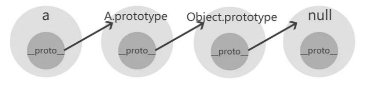

## prototype 和 __proto__
* JS的原型主要由2个属性来实现：原型：prototype 和隐式原型：（__proto__）
* （__proto__）是JS里面每个object都有的属性，但是（__proto__）不是一个规范属性，只是主流浏览器实现了这个属性。
* prototype是函数才有的属性。

```javascript
var a = {};
console.log(a.prototype);  //undefined
console.log(a.__proto__);  //Object {}

var b = function(){}
console.log(b.prototype);  //b {}
console.log(b.__proto__);  //function() {}
```

* 大多数情况下，（__proto__）可以理解为”构造器的原型“，即

```javascript
__proto__ === constructor.prototype  //通过Object.creat()创建的对象不适用于此等式
```

```javascript
var A = function(){};
var a = new A();

console.log(a.__proto__ === a.constructor.prototype); //true
console.log(A.prototype === a.constructor.prototype); //true
console.log(a.__proto__.__proto__ === Object.prototype); //true
console.log(a.__proto__.__proto__.__proto__); //null
```

## 原型链
<font color=#42b983>JS引擎查找对象上面的属性的时候，会先查找对象本身是否存在该属性，如果不存在，会在原型链上查找（不会查找自身的prototype），即查找当前对象的__proto__，此时如果__proto__上有属性,则获取，如果没有，___proto__会指向其constructor的prototype，也就是会查找其构造函数的prototype，如果没有，继续查找当前__proto__的__proto__，一直到Object.prototype.__proto__为止，此时返回underfined,因为Object.prototype.__proto__为null。</font>由__proto__属性组成的一条查询链称为原型链

 

```javascript
var A = function(){};
var a = new A();
console.log(a.__proto__); //A {}（即构造器function A 的原型对象）
console.log(a.__proto__.__proto__); //Object {}（即构造器Function Object 的原型对象）
console.log(a.__proto__.__proto__.__proto__); //null
```

## 创建对象

```javascript
/*1、字面量方式*/
var a = {};
console.log(a.__proto__);  //Object {}

console.log(a.__proto__ === a.constructor.prototype); //true

/*2、构造器方式*/
var A = function(){};
var a = new A();
console.log(a.__proto__); //A {}

console.log(a.__proto__ === a.constructor.prototype); //true

/*3、Object.create()方式*/
var a1 = {a:1}
var a2 = Object.create(a1);
console.log(a2.__proto__); //Object {a: 1}

console.log(a2.__proto__ === a2.constructor.prototype); //false
//a2的_proto_指向传入的对象{a: 1}, 这里传入的不管是对象还是func，上面等式都不成立

/*4、Class 作为构造函数的语法糖，同时有prototype属性和__proto__属性，因此同时存在两条继承链。*/
class A {
}

class B extends A {
}

B.__proto__ === A // true  子类的__proto__属性，表示构造函数的继承，总是指向父类。
B.prototype.__proto__ === A.prototype // true  子类prototype属性的__proto__属性，表示方法的继承，总是指向父类的prototype属性。
```

## 总结

* **一个实例化对象的__proto__属性指向其构造器（A）的原型，构造器的原型可以用A.prototype或者a.constructor.prototype来表示**

* 对象的_proto_和A.constructor.prototype不一定相等，比如Object.create()就不是

* {}创建对象效率是最高的，不需要执行构造函数，_proto_直接指向Object

* new 一个对象的过程，新对象的_proto_指向该构造函数的prototype

* Object.create()对象内部包含了new 运算符，新对象的_proto_指向传入的对象

* new和Object.create()的区别，_proto_是否指向传入的对象

* new创建的实例的prototype默认是undefined

```javascript
var A = function(){};
var a = new A();
a.prototype  //undefined
```  
* Object.create(obj)创建的对象prototype存不存在取决于obj有没有prototype属性
  
* **class创建的对象默认有prototype属性，不需要通过_proto_向上查找**

## 注意事项

#### 原型链上的属性或方法都是被实例化对象共用的，所以最好不要在原型链上使用对象，很容易影响其他实例对象
