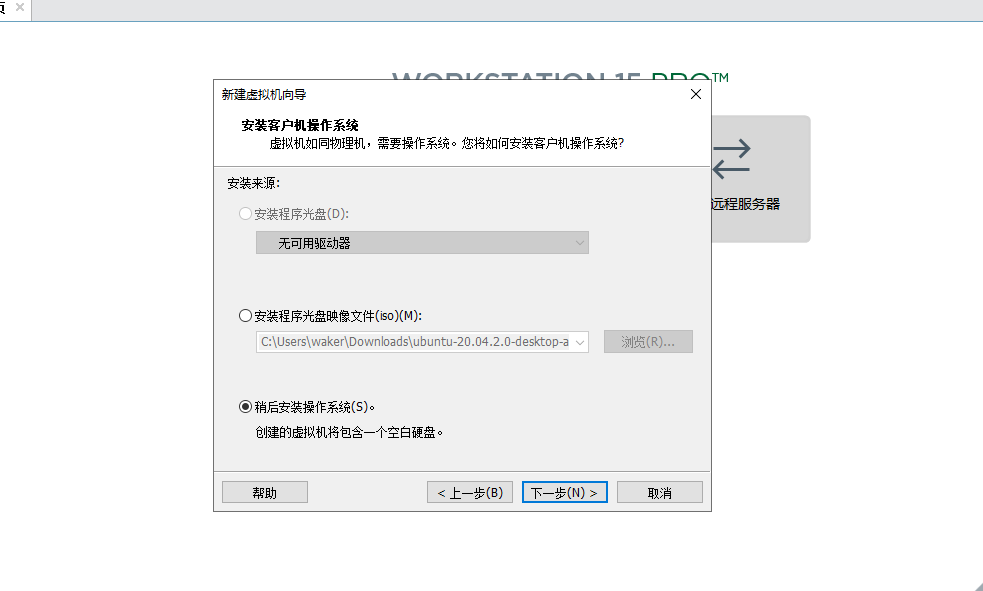
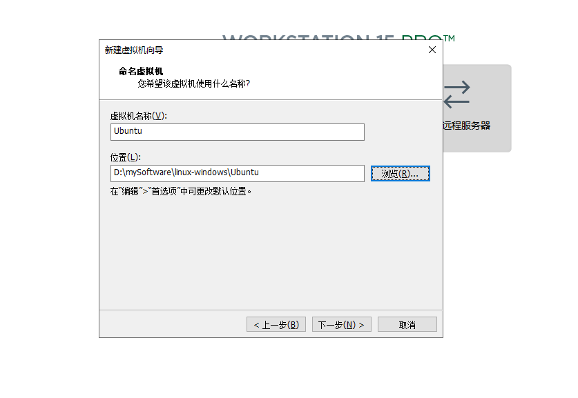
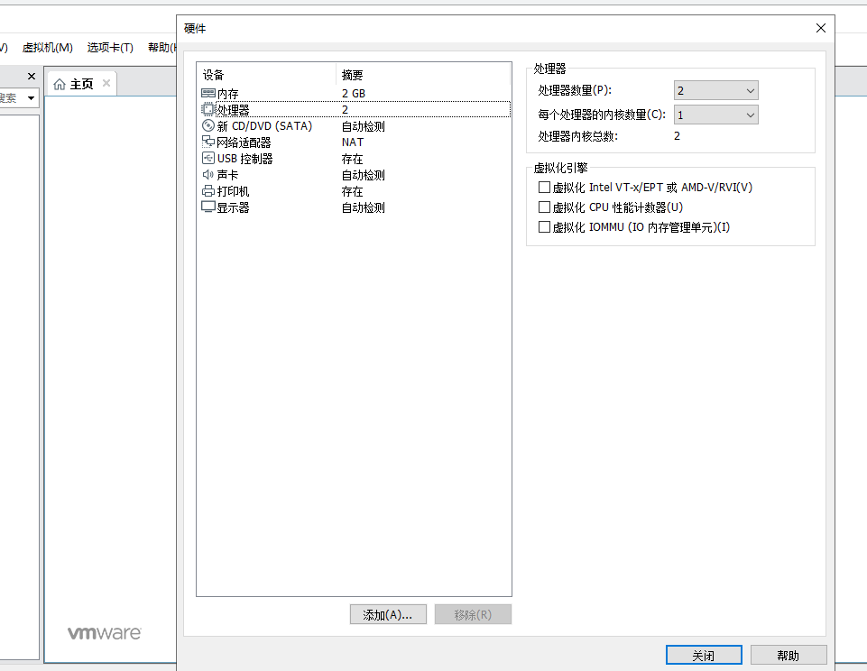
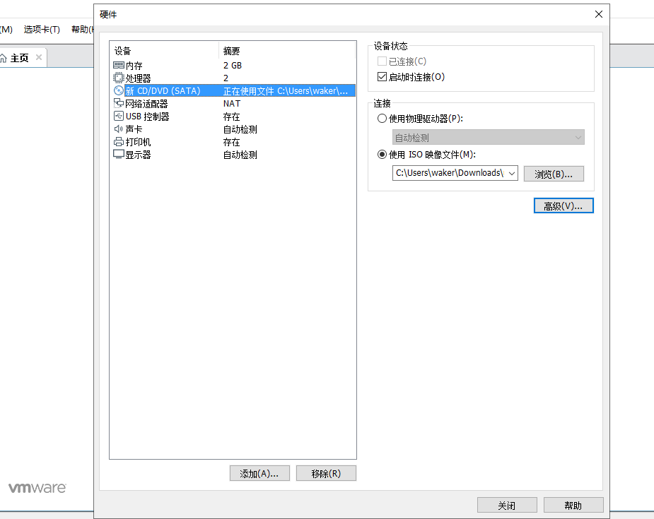
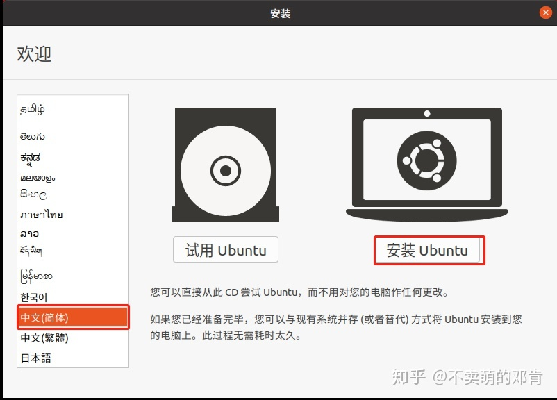
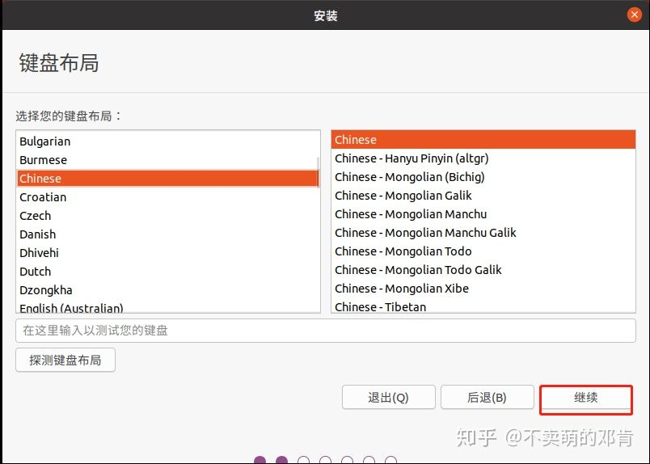

## windows 安装

#### 虚拟机VMware

> VMware Workstation Pro是在单个Linux或Windows PC上以虚拟机(vm)的形式运行多个操作系统来构建、测试或演示软件的行业标准。

[下载地址](https://www.vmware.com/products/workstation-pro/workstation-pro-evaluation.html)

VMware Workstation 15 Pro永久激活密钥：
```javascript

UA5DR-2ZD4H-089FY-6YQ5T-YPRX6

ZF582-0NW5N-H8D2P-0XZEE-Z22VA

YG5H2-ANZ0H-M8ERY-TXZZZ-YKRV8

UG5J2-0ME12-M89WY-NPWXX-WQH88

GA590-86Y05-4806Y-X4PEE-ZV8E0

YA18K-0WY8P-H85DY-L4NZG-X7RAD
```

#### Linux系统

[Ubuntu下载地址](https://ubuntu.com/download/desktop)

#### 安装步骤

* 首先安装VMware并激活

* 打开VMware

* 点击创建新的虚拟机——默认（推荐），然后下一步

* 选择光盘映像文件，导入的文件为Ubuntu Linux系统，选择稍后安装，下一步

 

* 选择操作系统和版本——linux,下一步

* 对系统进行命名，以及选择虚拟机存储位置（建议不要放在系统盘）
  
 

* 分配磁盘容量，选择单文件存储
  
* 在自定义硬件中选择合适的内存和处理器。
  
 

* 选择刚才下载好的ubuntu，然后关闭点击完成
  
 

* 等待其自行加载ubuntu。

    * 如果此主机支持 Intel VT-x，但 Intel VT-x 处于禁用状态。打开BIOS修改cpu设置，开器虚拟化

    * VMware Workstation 与 Device/Credential Guard 不兼容，则禁用DeviceCredential Guard

```javascript
控制面板-程序-开启或关闭windows功能，找到Hyper-V选项去掉√
```

* 选择简体中文并且安装ubuntu。

 

* 选择chinese点击继续

 

* 选择正常安装之后点击继续

* 现在安装-继续-完成个人信息配置

* 安装完成之后重启虚拟机

#### 以上就是整个windows安装虚拟机的完整步骤 [参考](https://zhuanlan.zhihu.com/p/141033713)

## 安装软件

```javascript
https://www.cnblogs.com/sablier/p/10915171.html

https://www.iplayio.cn/post/9846292
```

## 命令

```javascript
su root //切换到root用户

sudo passwd root  //更新密码

sudo apt-get install <package_name> //安装软件

sudo -get install git  //git

// 安装node
curl -sL https://deb.nodesource.com/setup_14.x | sudo -E bash -
sudo apt-get install -y nodejs
sudo apt install build-essential  //为了能够从npm编译本机插件，您需要安装开发工具：

//卸载
sudo apt-get --purge remove  <package_name>

history //查看命令记录
```

## 生成SSH 密匙

```javascript
ssh-keygen -t rsa -C "934563572@qq.com"

cat ~/.ssh/id_rsa.pub

然后复制查出来的文本段
```

## Ubuntu安装docker

```javascript
//安装docker.io
sudo apt-get install docker

//安装docker-compose
sudo curl -L "https://github.com/docker/compose/releases/download/1.24.1/docker-compose-$(uname -s)-$(uname -m)" -o /usr/local/bin/docker-compose

//添加运行权限
sudo chmod +x /usr/local/bin/docker-compose

//查看docker-compose版本
docker-compose --version

```