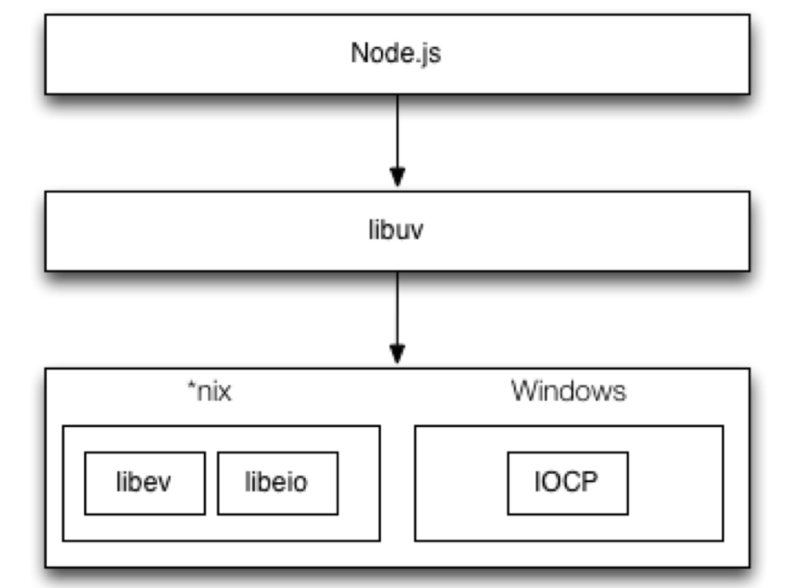
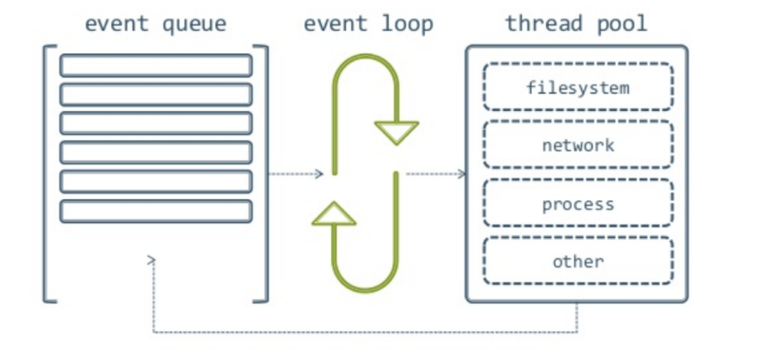

# 基础知识
## 导出模块——Node
#### Nodejs中exports与module.exports的区别
> 在node执行一个文件时，会给这个文件内生成一个 exports和module对象，而module又有一个exports属性。他们之间的关系如下图，都指向一块{}内存区域。
```javascript
exports = module.exports = {};
```
***
那下面我们来看看代码的吧
```javascript
//utils.js
let a = 100;
 
console.log(module.exports); //能打印出结果为：{}
console.log(exports); //能打印出结果为：{}
 
exports.a = 200; //这里把 module.exports 的内容给改成 {a : 200}
 
exports = '指向其他内存区'; //这里把exports的指向指走
 
//test.js
 
var a = require('/utils');
console.log(a) // 打印为 {a : 200}
```
从上面可以看出，其实require导出的内容是module.exports的指向的内存块内容，并不是exports的。简而言之，区分他们之间的区别就是： **exports 只是 module.exports的引用，辅助后者添加内容用的。**
***
1. exports 只是 module.exports的引用，辅助后者添加内容用的。

2. require()返回的是 module.exports 指向的内存块内容而不是 exports的，当exports被赋值为一个新的对象时，它将会断开与module.exports的关系

3. module.exports 初始值为一个空对象 {}

4. 为了避免混乱，尽量都用 module.exports 导出，然后用require导入

## 导出模块——ES6
#### ES6中的export default 和 export 区别
```javascript
'use strict'
//导出变量
export const a = '100'; 
 
 //导出方法
export const dogSay = function(){ 
 console.log('wang wang');
}
 
 //导出方法第二种
function catSay(){
 console.log('miao miao'); 
}
export { catSay };
 
//export default导出
const m = 100;
export default m; 
//export defult const m = 100;// 这里不能写这种格式。
```
***
1. export与export default均可用于导出常量、函数、文件、模块等

2. 在一个文件或模块中，export、import可以有多个，export default仅有一个

3. 通过export方式导出，在导入时要加{ }，export default则不需要

4. export能直接导出变量表达式，export default不行

## 导入模块
#### import（es6） 和 require（node） 的区别
> 用require还是import?如果宿主环境支持import则2种方式都可以都出，如果不支持需要通过babel将import转换成require,这也是为什么在模块导出时使用module.exports，在引入模块时使用import仍然起效，因为本质上，import会被转码为require去执行

* require是运行时调用，所以require理论上可以运用在代码的任何地方,import是编译时调用，所以必须放在文件开头

* require是赋值过程，其实require的结果就是对象、数字、字符串、函数等，再把require的结果赋值给某个变量,import是解构过程，但是目前所有的引擎都还没有实现import，我们在node中使用babel支持ES6，也仅仅是将ES6转码为ES5再执行，import语法会被转码为require

```javascript
const express = require('express');
 
import { dogSay, catSay } from './testEs6Export'; //导出了 export 方法 
import m from './testEs6Export'; //导出了 export default （这里的m可以命名成其他名字，都能获取到default定义的东西）
 
import * as testModule from './testEs6Export'; //as 集合成对象导出
```

## node事件循环

* Node 采用的是单线程的处理机制(所有的 I/O 请求都采用非阻塞的工作方式)，至少从 Node.js 开发者的角度是这样的。而在底层，Node.js 借助 libuv 来作为抽象封装层，从而屏蔽不同操作系统的差异，Node 可以借助 livuv 来实现线程。下图表示 Node 和 libuv 的关系。



* Libuv 库负责 Node API 的执行。它将不同的任务分配给不同的线程，形成一个事件循环，以异步的方式将任务的执行结果返回给 V8 引擎。可以简单用下面这张图来表示。



* 每一个 I/O 都需要一个回调函数 ----- 一旦执行完便堆到事件循环上用于执行。

#### 总结

> 事件循环其实就是一个事件队列，先加入先执行，执行完一次队列，再次循环遍历看有没有新事件加入队列。执行中的事件叫IO事件， setlmmediate在当前队列中立即执行，setTimout/setInterval把执行定时到下一个队列， process. nextTick在当前队列执行完，下次遍历前执行。所以总体顺序是：IO事件→ setImmediate→ setTimeout/setInterval→ process. nextTick。

## 程序交互

两个 Node. js程序之间如何交互？

通过fork实现父子程序之间的交互。子程序用 process.on、 process. send访问父程序，父程序用 child.on、 child.send访问子程序。

关于 parent. JS的示例代码如下。

```javascript
var cp = require (' child_process' ) ;
 var child= cp.fork ('./child. js' );
child .on（'message'， function（msg）{
 console.1og（'子程序发送的数据：'，msg )
})
child.send ( '来自父程序发送的数据' )
```

关于 child .js的示例代码如下。

```javascript
process .on ( 'message' , function（msg）{
conso1e.1og ( '父程序发送的数据: ' , msg )
process.send ( '来自子程序发送的数据' )
```


