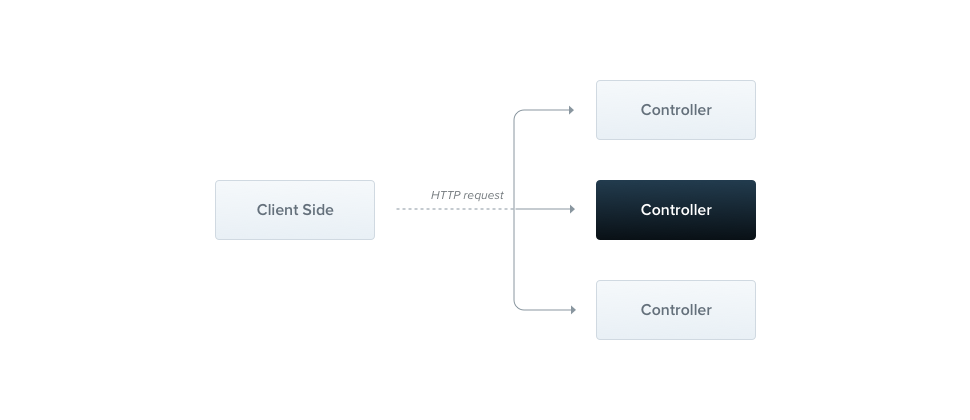

## 介绍

#### [官网](https://nestjs.bootcss.com/)

#### [github](https://github.com/nestjs/nest)

#### [参考1](https://zhuanlan.zhihu.com/p/267286129) [参考2](https://zhuanlan.zhihu.com/p/71987482)

> Nest (NestJS) 是一个用于构建高效、可扩展的 Node.js 服务器端应用程序的开发框架。它利用 JavaScript 的渐进增强的能力，使用并完全支持 TypeScript （仍然允许开发者使用纯 JavaScript 进行开发），并结合了 OOP （面向对象编程）、FP （函数式编程）和 FRP （函数响应式编程）。

> 在底层，Nest 构建在强大的 HTTP 服务器框架上，例如 Express （默认），并且还可以通过配置从而使用 Fastify ！

> Nest主要解决了架构问题：尽管 Node （和服务器端 JavaScript）拥有大量优秀的软件库、辅助程序和工具，但没有一个能够有效地解决我们所面对的主要问题，即 架构。服务端的代码需要有一定的架构约束，比如目录，代码等，nest的出现解决了这一问题，这使得nest看起来更新java spring框架。Nest 提供了一个开箱即用的应用程序体系结构，允许开发者及其团队创建高度可测试、可扩展、松散耦合且易于维护的应用程序。这种架构深受 Angular 的启发。

## 起步
#### 用[Nest CLI](https://nestjs.bootcss.com/cli/overview) 来快速创建

```javascript
npm install -g @nestjs/cli

nest new my-nest-project

cd my-nest-project

npm run start:dev

http://localhost:3000 
``` 

#### 或者，使用 Git 安装采用 TypeScript 开发的 starter 项目

```javascript
git clone https://github.com/nestjs/typescript-starter.git project

cd project

npm install

npm run start

http://localhost:3000 
``` 

**npm run start:dev 和 npm run start启动的区别：如果是直接 npm start 或者 yarn start 的话，虽然服务启动了，但是我们如果在开发的过程中修改了文件，就要手动停止服务然后重新启动，效率挺低的。以 dev 模式启动，这样 Nest 会自动检测我们的文件变化，然后自动重启服务。**

#### src下核心模块说明

* app.controller.ts	带有单个路由的基本控制器。
  
* app.controller.spec.ts	针对控制器的单元测试
  
* app.module.ts	T应用程序的根模块（root module）。
  
* app.service.ts	具有单一方法的基本服务（service）。 method.
  
* main.ts	应用程序的入口文件，它使用核心函数 NestFactory 来创建 Nest 应用程序的实例。

#### main.ts 文件中包含了一个异步函数，此函数将 引导（bootstrap） 应用程序的启动过程：

```javascript
@@filename(main)

import { NestFactory } from '@nestjs/core';
import { AppModule } from './app.module';

async function bootstrap() {
  const app = await NestFactory.create(AppModule);
  await app.listen(3000);
}
bootstrap();
@@switch
import { NestFactory } from '@nestjs/core';
import { AppModule } from './app.module';

async function bootstrap() {
  const app = await NestFactory.create(AppModule);
  await app.listen(3000);
}
bootstrap();
```

要创建一个 Nest 应用程序的实例，我们使用了 NestFactory 核心类。NestFactory 暴露了一些静态方法用于创建应用程序的实例。其中，create() 方法返回一个应用程序的对象，该对象实现了 INestApplication 接口。该对象还提供了一组方法，这些方法将在接下来的章节中进行介绍。在上面的 main.ts 示例中，我们仅启动了 HTTP 侦听器，该侦听器使应用程序可以侦听入栈的 HTTP 请求。

请注意，使用 Nest CLI 创建的项目会拥有一个初始的项目结构，以鼓励开发人员将每个模块保存在其专用目录中。

## 平台

#### Nest 的目标是成为一个与平台无关的框架。

平台独立性使创建可重用的逻辑部分成为可能，开发人员可以在多种不同类型的应用程序中利用这些逻辑部分。 从技术上讲，一旦创建了适配器，Nest 便可以使用任何 Node HTTP 框架。 目前支持两个 HTTP 平台：[express](https://expressjs.com/) 和 [fastify](https://www.fastify.io/)。 您可以根据您的需求选择最适合平台。

|  name   | des  |
|  ----  | ----  |
| platform-express  | Express 是一个著名的、极简的、专为 node 开发的 web 框架。它久经考验、适用于生产环境的软件库，并且拥有大量的社区资源。默认情况下使用 @nestjs/platform-express 软件包。许多用户对 Express 都很满意，并且无需采取任何操作即可启用它。 |
| platform-fastify  | Fastify 是一个高性能且低开销的框架，高度专注于提供最高的效率和速度。点击 这里 查看它的使用文档。 |

无论使用那个平台，都会将平台的 application 接口暴露出来。它们分别是 NestExpressApplication 和 NestFastifyApplication。

当您将类型信息传递给 NestFactory.create() 方法时，如下例所示，app 对象将具有该特定平台的专用方法。但是请注意，除非 您确实需要访问底层平台的 API，否则 无需 指定平台类型。

```javascript
const app = await NestFactory.create<NestExpressApplication>(AppModule);
```

## 试用

#### 创建 Module

我们这次就创建一个 User 模块，写一个用户增删改查，带大家熟悉一下这个过程。

```javascript
nest g module user server
```

脚手架工具会自动在 src/server/user 文件夹下创建一个 user.module.ts，这是 Nest 的模块文件，Nest 用它来组织整个应用程序的结构。

```javascript
// user.module.ts
import { Module } from '@nestjs/common';

@Module({})
export class UserModule {}
```

同时还会在根模块 app.module.ts 中引入 UserModule 这个模块，相当于一个树形结构，在根模块中引入了 User 模块。

执行上面的终端命令之后，我们会惊讶地发现，app.module.ts 中的代码已经发生了变化，在文件顶部自动引入了 UserModule，同时也在 @Module 装饰器的 imports 中引入了 UserModule。

```javascript
// app.module.ts
import { Module } from '@nestjs/common';
import { AppController } from './app.controller';
import { AppService } from './app.service';
import { UserModule } from './server/user/user.module'; // 自动引入

@Module({
  imports: [UserModule], // 自动引入
  controllers: [AppController],
  providers: [AppService]
})
export class AppModule {}
```

#### 创建 Controller

```javascript
nest g controller user server
```

在 Nest 中，controller 就类似前端的路由，负责处理客户端传入的请求和服务端返回的响应。

举个例子，我们如果要通过 http://localhost:5000/user/users 获取所有的用户信息，那么我们可以在 UserController 中创建一个 GET 方法，路径为 users 的路由，这个路由负责返回所有的用户信息。

```javascript
// user.controller.ts
import { Controller, Get } from '@nestjs/common';

@Controller('user')
export class UserController {
  @Get('users')
  findAll(): string {
    return "All User's Info"; // [All User's Info] 暂时代替所有用户的信息
  }
}
```
这就是 controller 的作用，负责分发和处理请求和响应。

当然，也可以把 findAll 方法写成异步方法，像这样：

```javascript
// user.controller.ts
import { Controller, Get } from '@nestjs/common';

@Controller('user')
export class UserController {
  @Get('users')
  async findAll(): Promise<any> {
    return await this.xxx.xxx(); // 一些异步操作
  }
}
```

#### 创建 Provider

```javascript
nest g service user server
```
provider 我们可以简单地从字面意思来理解，就是服务的提供者。

怎么去理解这个服务提供者呢？举个例子，我们的 controller 接收到了一个用户的查询请求，我们不能直接在 controller 中去查询数据库并返回，而是要将查询请求交给 provider 来处理，这里我们创建了一个 UserService，就是用来提供数据库操作服务的。

```javascript
// user.service.ts
import { Injectable } from '@nestjs/common';

@Injectable()
export class UserService {}
```
当然，provider 不一定只能用来提供数据库的操作服务，还可以用来做一些用户校验，**比如使用 JWT 对用户权限进行校验的策略**，就可以写成一个策略类，放到 provider 中，为模块提供相应的服务。

挺多文档将 controller 和 provider 翻译为控制器和提供者，我感觉这种翻译挺生硬的，让人不知所云，所以我们姑且记忆他们的英文名吧。

controller 和 provider 都创建完后，我们又会惊奇地发现，user.module.ts 文件中多了一些代码，变成了这样：

```javascript
// user.module.ts
import { Module } from '@nestjs/common';
import { UserController } from './user.controller';
import { UserService } from './user.service';

@Module({
  controllers: [UserController],
  providers: [UserService]
})
export class UserModule {}
```

## 连接数据库

#### 引入 Mongoose 根模块

安装依赖包
```javascript
npm install --save @nestjs/mongoose mongoose
```

连接数据之前，我们要先在根模块，也就是 app.module.ts 中引入 Mongoose 的连接模块：

```javascript
// app.module.ts
import { Module } from '@nestjs/common';
import { MongooseModule } from '@nestjs/mongoose';
import { AppController } from './app.controller';
import { AppService } from './app.service';
import { UserModule } from './server/user/user.module';

@Module({
  imports: [MongooseModule.forRoot('mongodb://localhost:27017/xxx'), UserModule],
  controllers: [AppController],
  providers: [AppService]
})
export class AppModule {}
```
这段代码里面的 mongodb://localhost/xxx 其实就是本地数据库的地址，xxx 是数据库的名字。

这时候保存文件，肯定有同学会发现控制台还是报错的，我们看一下报错信息就很容易知道问题在哪里了。

其实就是 mongoose 模块没有类型声明文件，这就很容易解决了，安装一下就好(正常不需要安装，如果报错可尝试)：

```javascript
npm install @types/mongoose --dev 或者 yarn add @types/mongoose --dev
```

安装完之后服务就正常重启了。

#### 引入 Mongoose 分模块

这里我们先要创建一个数据表的格式，在 src/server/user 文件夹下创建一个 user.schema.ts 文件，定义一个数据表的格式：

```javascript
// user.schema.ts
import { Schema } from 'mongoose';

export const userSchema = new Schema({
  _id: { type: String, required: true }, // 覆盖 Mongoose 生成的默认 _id
  user_name: { type: String, required: true },
  password: { type: String, required: true }
});
```

然后将我们的 user.module.ts 文件修改成这样：

```javascript
// user.module.ts
import { Module } from '@nestjs/common';
import { MongooseModule } from '@nestjs/mongoose';
import { UserController } from './user.controller';
import { userSchema } from './user.schema';
import { UserService } from './user.service';

@Module({
  imports: [MongooseModule.forFeature([{ name: 'Users', schema: userSchema }])],
  controllers: [UserController],
  providers: [UserService]
})
export class UserModule {}
```

好了，现在一切就绪，终于可以开始编写我们的 CRUD 逻辑了！冲冲冲~

## 操作数据库

#### CRUD

我们打开 user.service.ts 文件，为 UserService 类添加一个构造函数，让其在实例化的时候能够接收到数据库 Model，这样才能在类中的方法里操作数据库。

```javascript
// user.service.ts
import { Injectable } from '@nestjs/common';
import { InjectModel } from '@nestjs/mongoose';
import { Model } from 'mongoose';
import { CreateUserDTO } from './user.dto';
import { User } from './user.interface';

@Injectable()
export class UserService {
  constructor(@InjectModel('Users') private readonly userModel: Model<User>) {}

  // 查找所有用户
  async findAll(): Promise<User[]> {
    const users = await this.userModel.find();
    return users;
  }

  // 查找单个用户
  async findOne(_id: string): Promise<User> {
    return await this.userModel.findById(_id);
  }

  // 添加单个用户
  async addOne(body: CreateUserDTO): Promise<void> {
    await this.userModel.create(body);
  }

  // 编辑单个用户
  async editOne(_id: string, body: EditUserDTO): Promise<void> {
    await this.userModel.findByIdAndUpdate(_id, body);
  }

  // 删除单个用户
  async deleteOne(_id: string): Promise<void> {
    await this.userModel.findByIdAndDelete(_id);
  }
}
```

因为 mongoose 操作数据库其实是异步的，所以这里我们使用 async 函数来处理异步的过程。

好奇的同学会发现，这里突然出现了两个文件，一个是 user.interface.ts，另一个是 user.dto.ts，我们现在来创建一下：

```javascript
// user.interface.ts
import { Document } from 'mongoose';

export interface User extends Document {
  readonly _id: string;
  readonly user_name: string;
  readonly password: string;
}
```

```javascript
// user.dto.ts
export class CreateUserDTO {
  readonly _id: string;
  readonly user_name: string;
  readonly password: string;
}

export class EditUserDTO {
  readonly user_name: string;
  readonly password: string;
}
```

其实就是对数据类型做了一个定义。

现在，我们可以到 user.controller.ts 中设置路由了，将客户端的请求进行处理，调用相应的服务实现相应的功能：

```javascript
// user.controller.ts
import {
  Body,
  Controller,
  Delete,
  Get,
  Param,
  Post,
  Put
} from '@nestjs/common';
import { CreateUserDTO, EditUserDTO } from './user.dto';
import { User } from './user.interface';
import { UserService } from './user.service';

interface UserResponse<T = unknown> {
  code: number;
  data?: T;
  message: string;
}

@Controller('user')
export class UserController {
  constructor(private readonly userService: UserService) {}

  // GET /user/users
  @Get('users')
  async findAll(): Promise<UserResponse<User[]>> {
    return {
      code: 200,
      data: await this.userService.findAll(),
      message: 'Success.'
    };
  }

  // GET /user/:_id
  @Get(':_id')
  async findOne(@Param('_id') _id: string): Promise<UserResponse<User>> {
    return {
      code: 200,
      data: await this.userService.findOne(_id),
      message: 'Success.'
    };
  }

  // POST /user
  @Post()
  async addOne(@Body() body: CreateUserDTO): Promise<UserResponse> {
    await this.userService.addOne(body);
    return {
      code: 200,
      message: 'Success.'
    };
  }

  // PUT /user/:_id
  @Put(':_id')
  async editOne(
    @Param('_id') _id: string,
    @Body() body: EditUserDTO
  ): Promise<UserResponse> {
    await this.userService.editOne(_id, body);
    return {
      code: 200,
      message: 'Success.'
    };
  }

  // DELETE /user/:_id
  @Delete(':_id')
  async deleteOne(@Param('_id') _id: string): Promise<UserResponse> {
    await this.userService.deleteOne(_id);
    return {
      code: 200,
      message: 'Success.'
    };
  }
}
```

至此，我们就完成了一个完整的 CRUD 操作，接下来我们通过postman或者前端发送async api测试一下~


## 跨域

#### nest解决跨域问题就跟简单了，只需在NestJS入口文件main.ts加上一句

```javascript
import { NestFactory } from '@nestjs/core';
import { AppModule } from './app.module';

async function bootstrap() {
  const app = await NestFactory.create(AppModule);
  app.enableCors(); //允许跨域
  await app.listen(3000);
}
bootstrap();
```

## 总结

#### 至此一个简单的nest app就创建出来了，对一些基础的概念也有了一定的了解和理解

然后我们再来看看Controllers，Providers，Modules分别是什么

> 控制器负责处理传入请求并向客户端返回响应。比如上例中的路由都写在user.controller.ts里面



> provider 我们可以简单地从字面意思来理解，就是服务的提供者,controller 接收到了一个用户的查询请求，我们不能直接在 controller 中去查询数据库并返回，而是要将查询请求交给 provider 来处理，这里我们创建了一个 UserService，就是用来提供数据库操作服务的,user.service.ts


> 模块是一个用@Module()装饰器注解的类。@Module()装饰器提供了Nest用来组织应用程序结构的元数据。就是module是每一个模块的入口文件，同时这个模块也会添加到跟模块里面，就像一个树结构，每个子模块像树的一个分支：user.module.ts组织UserController和UserService，最后又注入到跟模块app.module.ts


> 相关文件说明

* user.controller.ts  Controller
* user.service.ts.ts  Provider
* user.module  Module
* user.schema.ts  定义一个数据表的格式（data schema）
* user.interface.ts 定义数据库返回数据的数据类型（输出），在Provider里引用
* user.dto.ts  定义接口接受参数的数据类型（输入）,在Provider和Controller里引用
* xxx.spec.ts  测试文件
