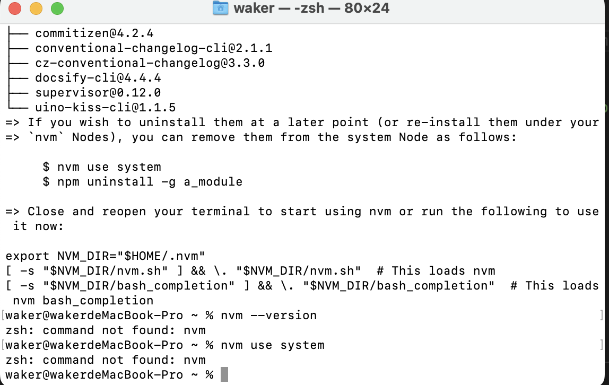

## 作用

> node 版本管理工具

## 一、windwos 下安装

## 下载

### [nvm-windows](https://github.com/coreybutler/nvm-windows)

> 安装完成需要在 nvm 所在目录打开 CMD

## 原理

> nvm 可安装在任何目录，其运行原理就是替换 C:\Program Files\nodejs 下的 nodeJS，所以 node 可安装在任何目录。

## 修改环境变量

> 我的电脑->属性->高级系统设置->环境变量，在用户变量中添加环境变量：

1. NVM_HOME:E:\dev\nvm
2. NVM_SYMLINK:E:\dev\nodejs
3. PATH:%NVM_HOME%;%NVM_SYMLINK%（如果 path（大小写都视为存在）已经存在那么添加值到最后【%NVM_HOME%;%NVM_SYMLINK%】）

> 切换完版本有些全局包要重写安装，比如 npm install gulp -g，因为每一个 node 都是独立版本环境。

### [各版本 node](https://nodejs.org/zh-cn/download/releases/)

## 常用命令

```javascript
nvm install node版本号

nvm list 查看所有版本

nvm use node版本号

nvm current 显示当前版本

nvm uninstall <version> 卸载制定的版本

nvm root：查看根目录  D:  \mySoftware\nvmWindows\nvm-setup\nvm（D:→cd mySoftware\nvmWindows\nvm-setup\nvm）
```

## 一、macos 下安装

## 下载

### [nvm](https://github.com/nvm-sh/nvm/releases)

```js
curl -o- https://raw.githubusercontent.com/creationix/nvm/v0.39.3/install.sh | bash
```

安装完可能有如下提示：



解决办法：重启 terminal 即可，无须手动配置环境变量

在系统节点中删除全局的 node 包

```js
nvm use system
npm uninstall -g a_module
```

last: 重启电脑，各个项目可单独选择依赖 node 版本
