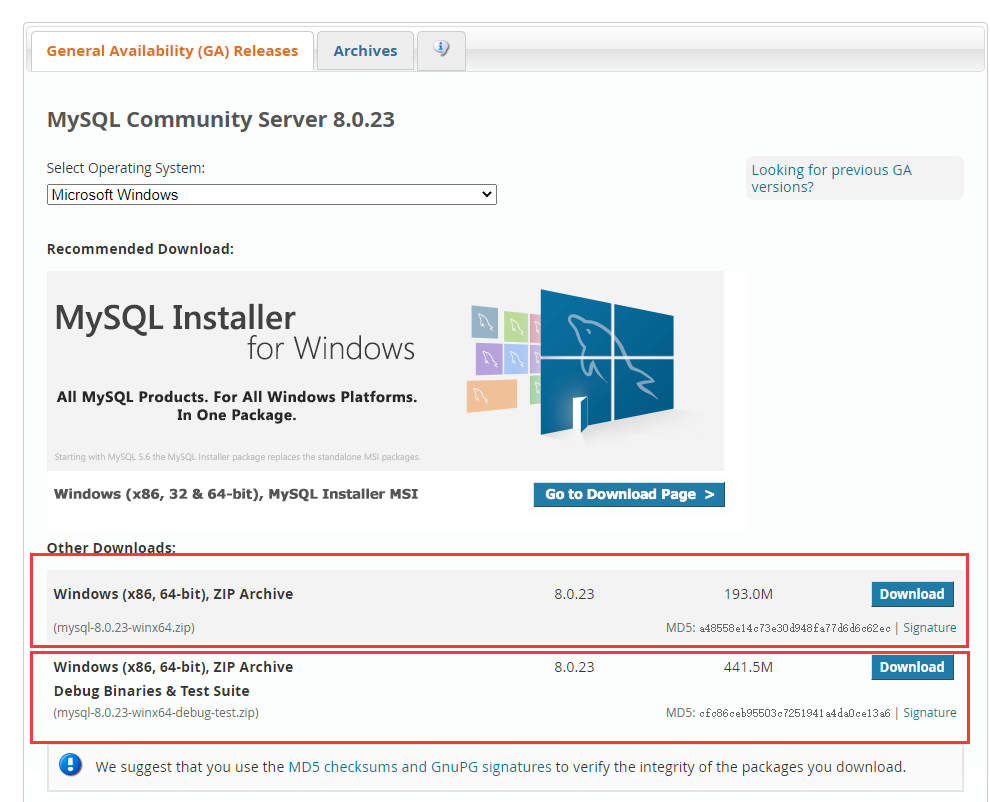
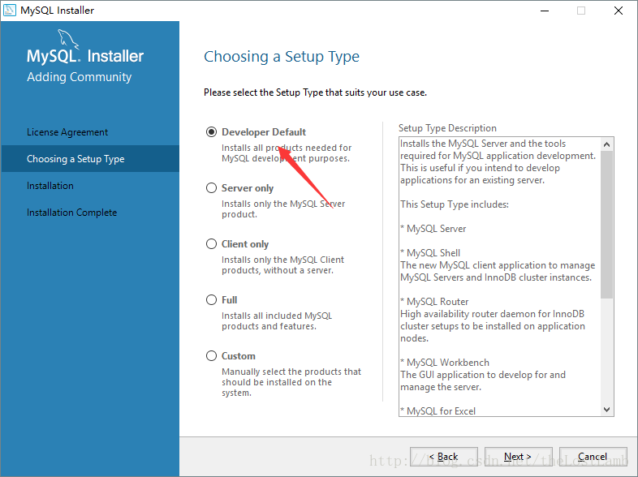
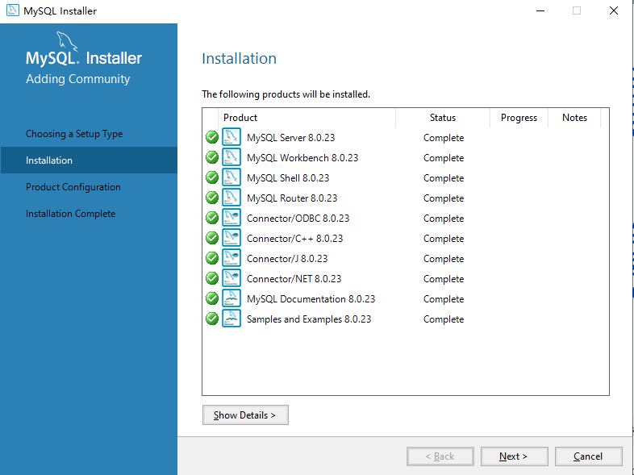
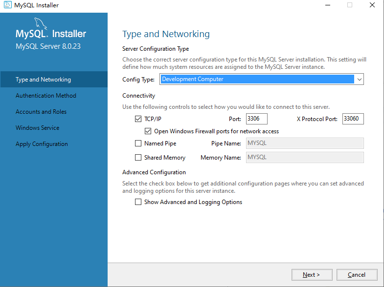
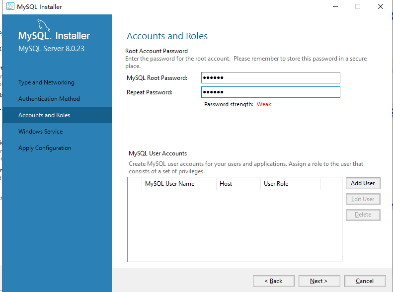
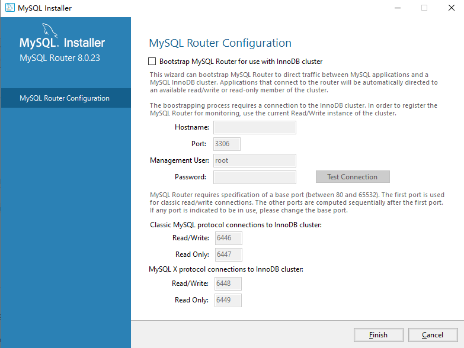
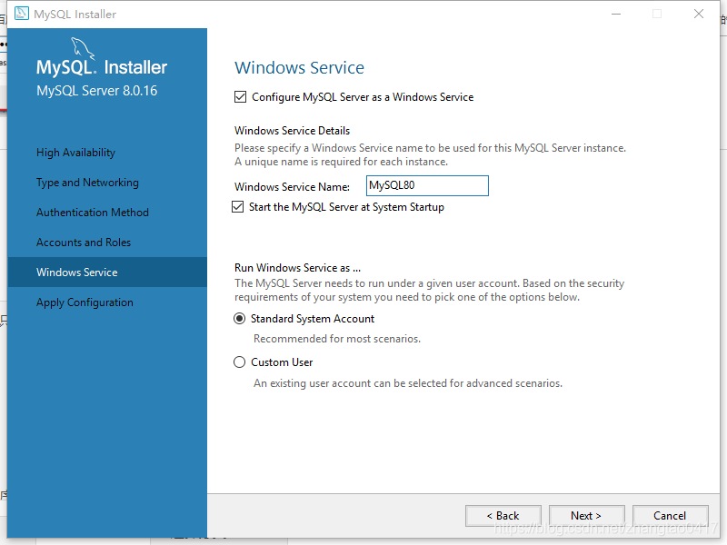
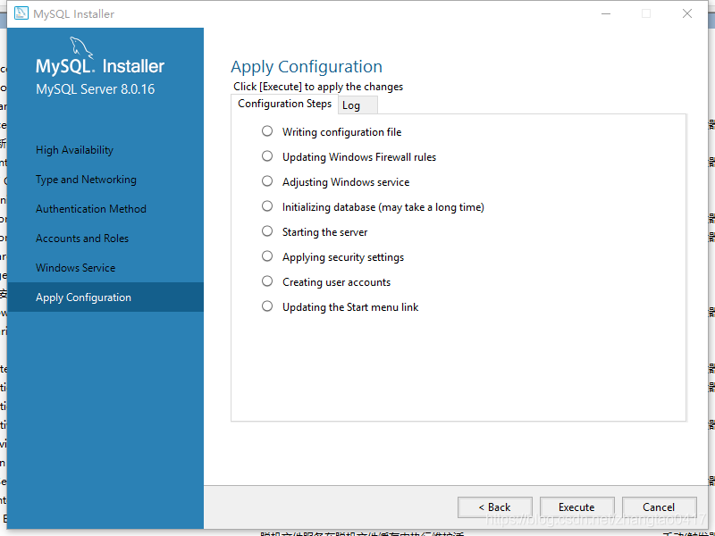
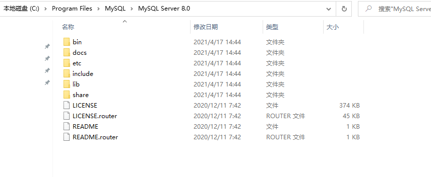

# 基础知识

## 介绍
> MySQL 是最流行的关系型数据库管理系统，在 WEB 应用方面 MySQL 是最好的 RDBMS(Relational Database Management System：关系数据库管理系统)应用软件之一。所谓的关系型数据库，是建立在关系模型基础上的数据库，借助于集合代数等数学概念和方法来处理数据库中的数据。

#### RDBMS 即关系数据库管理系统(Relational Database Management System)的特点：
* 数据以表格的形式出现
* 每行为各种记录名称
* 每列为记录名称所对应的数据域
* 许多的行和列组成一张表单
* 若干的表单组成database

## [官网](https://www.mysql.com/)

## [下载](https://dev.mysql.com/downloads/mysql/)

* 首先在官网下载 Community 版本，选择对应的操作系统，第一个为压缩包安装，可自定义路径，下面均为第二种安装方式
  


* 然后next到



* 检查安装条件完成，直接点击next进入下一步就可以了



* 然后配置类型选择第一个，这一步要注意，developmen/server/dedicate computer三个选项，是让你选择你安装mysql是用来干嘛的，开发测试就用development，占用系统资源少。server就是正式生产环境，至于dedicate，是特指这台电脑将完全被mysql占用所有资源，所以叫dedicate。其他的默认就好了，当然你想改都没问题的，改了默认端口要记得改成哪个，免得后面访问不了数据库
  



* 设置root密码（123456）



* 然后next到



* 这一步是将mysql注册为服务，Mysql80是服务名字，到时候你可以在系统的服务里面找到，然后next
  


* 最后安装，finish就好了。
  


#### **安装完后，默认安装在C:\Program Files\MySQL\MySQL Server 8.0的位置，服务也会自动打开，注意custom安装方式已经不支持自定义安装路径了，默认安装C盘，如果要自定义安装路径，可下载压缩包安装**

* 然后进入对应目录MySQL Server 8.0


> * bin目录下保存了MySQL常用的命令工具以及管理工具
> * docs目录下是MySQL的帮助文档
> * include目录和lib目录是MySQL所依赖的头文件以及库文件
> * share目录下保存目录文件以及日志文件。

* 进入bin(全路径：\Program Files\MySQL\MySQL Server 8.0\bin),打开cmd，输入mysql -u root -p后回车，然后会提示输入密码，输入密码后就会进入MySQL的操作管理界面
> 输入show databases；（注意末尾有分号）可以查看当前MySQL中的数据库列表，输入use test；可以进入test数据库（前提是要有此数据库），输入show tables可以查看test数据库> 中的所有表，输入quit可以退出MySQL的操作管理界面。
* 启动数据库
```javascript
cd c:/Program Files/MySQL/MySQL Server 8.0/bin
mysqld --console
```

* 关闭数据库
```javascript
cd c:/Program Files/MySQL/MySQL Server 8.0/bin
mysqladmin -uroot shutdown
```

* 选择图形化界面管理数据库，mysql自带的workbench或者navicat等其他管理软件

#### 以上就是mysql在windows下安装及使用的一个基础教程。

## 数据库操作( CURD )
#### 下面是一个基于koa的简单CURD
```javascript
const router = require('koa-router')()
const connection = require('../mysql')

//mysql 查询
router.post('/mysql/query', async (ctx) => {
    const sql = 'SELECT * FROM websites';
    await new Promise((resolve, reject) => {
        connection.query(sql, (error, result) => {
            if (error) reject(error);
            resolve(result);
        });
    }).then((result) => {
        ctx.body = {
            data: result
        }
    }).catch((err) => {
        console.log(err);
    });
})

//mysql 添加
router.post('/mysql/add', async (ctx) => {
    const addSqlParams = ctx.request.body.addSqlParams;
    const addSql = 'INSERT INTO websites(Id,name,url,alexa,country) VALUES(0,?,?,?,?)';
    await new Promise((resolve, reject) => {
        connection.query(addSql,addSqlParams, (error, result) => {
            if (error) reject(error);
            resolve(result);
        });
    }).then((result) => {
        ctx.body = {
            msg: 'success',
        }
    }).catch((err) => {
        console.log(err);
    });
})

//mysql 修改
router.post('/mysql/modify', async (ctx) => {
    const modSqlParams = ctx.request.body.modSqlParams;
    const modSql = 'UPDATE websites SET name = ?,url = ?,country = ? WHERE Id = ?';
    await new Promise((resolve, reject) => {
        connection.query(modSql,modSqlParams, (error, result) => {
            if (error) reject(error);
            resolve(result);
        });
    }).then((result) => {
        ctx.body = {
            msg: 'success',
        }
    }).catch((err) => {
        console.log(err);
    });
})

//mysql 删除
router.post('/mysql/del', async (ctx) => {
    const delSqlParams = ctx.request.body.id;
    const delSql = `DELETE FROM websites where id=${delSqlParams}`;
    await new Promise((resolve, reject) => {
        connection.query(delSql, (error, result) => {
            if (error) reject(error);
            resolve(result);
        });
    }).then((result) => {
        ctx.body = {
            msg: 'success',
        }
    }).catch((err) => {
        console.log(err);
    });
})
```