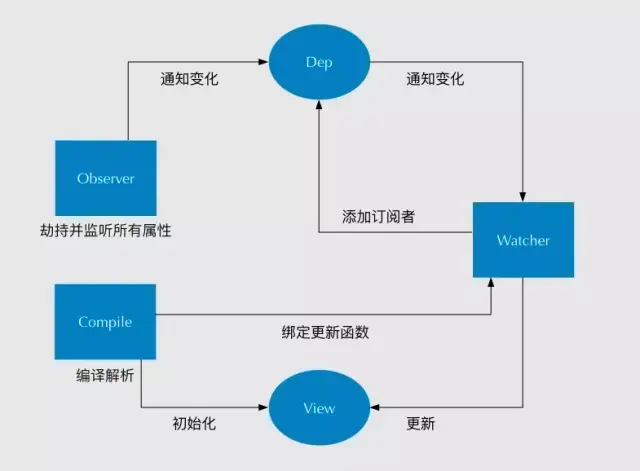

## 双向数据绑定

Vue 数据双向绑定主要是指：数据变化更新视图，视图变化更新数据

其中，View 变化更新 Data ，可以通过事件监听的方式来实现，**所以 Vue 的数据双向绑定的工作主要是如何根据 Data 变化更新 View。**

**vue是采用数据劫持结合发布者-订阅者模式的方式，通过 Object.defineProperty()来劫持各个属性的 setter，getter，在数据变动时发布消息给订阅者，触发相应的监听回调。**

Vue 主要通过以下 4 个步骤来实现数据双向绑定的：

1. 实现一个监听器 Observer：对数据对象进行遍历，包括子属性对象的属性，利用 Object.defineProperty() 对属性都加上 setter 和 getter。这样的话，给这个对象的某个值赋值，就会触发 setter，那么就能监听到了数据变化。

2. 实现一个解析器 Compile：解析 Vue 模板指令，将模板中的变量都替换成数据，然后初始化渲染页面视图，并将每个指令对应的节点绑定更新函数，添加监听数据的订阅者，一旦数据有变动，收到通知，调用更新函数进行数据更新。

3. 实现一个订阅者 Watcher：Watcher 订阅者是 Observer 和 Compile 之间通信的桥梁 ，主要的任务是订阅 Observer 中的属性值变化的消息，当收到属性值变化的消息时，触发解析器 Compile 中对应的更新函数。

4. 实现一个订阅器 Dep：订阅器采用 发布-订阅 设计模式，用来收集订阅者 Watcher，对监听器 Observer 和 订阅者 Watcher 进行统一管理。

> 总结：MVVM 作为数据绑定的入口，整合 Observer、Compile 和 Watcher 三者，通过 Observer 来监听自己的 model 数据变化，通过 Compile 来解析编译模板指令，
最终利用 Watcher 搭起 Observer 和 Compile 之间的通信桥梁，达到数据变化 -> 视图更新；视图交互变化(input) -> 数据 model 变更的双向绑定效果。

以上四个步骤的流程图表示如下，如果有同学理解不大清晰的，可以查看作者专门介绍数据双向绑定的文章《0 到 1 掌握：Vue 核心之数据双向绑定》，有进行详细的讲解、以及代码 demo 示例。



## Vue 框架怎么实现对象和数组的监听？

如果被问到 Vue 怎么实现数据双向绑定，大家肯定都会回答 通过 Object.defineProperty() 对数据进行劫持，但是 Object.defineProperty() 只能对属性进行数据劫持，不能对整个对象进行劫持，同理无法对数组进行劫持，但是我们在使用 Vue 框架中都知道，Vue 能检测到对象和数组（部分方法的操作）的变化，那它是怎么实现的呢？我们查看相关代码如下：

```javascript
 /**
   * Observe a list of Array items.
   */
  observeArray (items: Array<any>) {
    for (let i = 0, l = items.length; i < l; i++) {
      observe(items[i])  // observe 功能为监测数据的变化
    }
  }

  /**
   * 对属性进行递归遍历
   */
  let childOb = !shallow && observe(val) // observe 功能为监测数据的变化
```

通过以上 Vue 源码部分查看，我们就能知道 Vue 框架是通过遍历数组 和递归遍历对象，从而达到利用 Object.defineProperty() 也能对对象和数组（部分方法的操作）进行监听。

## Vue项目优化

[参考](https://mp.weixin.qq.com/s/qgOJmA1dxB2wor6_fk8yxg)

如果没有对 Vue 项目没有进行过优化总结的同学，可以参考本文作者的另一篇文章《 Vue 项目性能优化 — 实践指南 》，文章主要介绍从 3 个大方面，22 个小方面详细讲解如何进行 Vue 项目的优化。

1. 代码层面的优化

```javascript
v-if 和 v-show 区分使用场景

computed 和 watch 区分使用场景

v-for 遍历必须为 item 添加 key，且避免同时使用 v-if

长列表性能优化

事件的销毁

图片资源懒加载

路由懒加载

第三方插件的按需引入

优化无限列表性能

服务端渲染 SSR or 预渲染
```

2. Webpack 层面的优化?

```javascript
Webpack 对图片进行压缩

减少 ES6 转为 ES5 的冗余代码

提取公共代码

模板预编译

提取组件的 CSS

优化 SourceMap

构建结果输出分析

Vue 项目的编译优化
```

3. 基础的 Web 技术的优化

```javascript
开启 gzip 压缩

浏览器缓存

CDN 的使用

使用 Chrome Performance 查找性能瓶颈
```

## vue3.0 特性

Vue 3.0 正走在发布的路上，Vue 3.0 的目标是让 Vue 核心变得更小、更快、更强大，因此 Vue 3.0 增加以下这些新特性：

#### 1. 监测机制的改变

> 3.0 将带来基于代理 Proxy 的 observer 实现，提供全语言覆盖的反应性跟踪。这消除了 Vue 2 当中基于 Object.defineProperty 的实现所存在的很多限制：

* 只能监测属性，不能监测对象

* 检测属性的添加和删除；

* 检测数组索引和长度的变更；

* 支持 Map、Set、WeakMap 和 WeakSet。

> 新的 observer 还提供了以下特性：

* 用于创建 observable 的公开 API。这为中小规模场景提供了简单轻量级的跨组件状态管理解决方案。

* 默认采用惰性观察。在 2.x 中，不管反应式数据有多大，都会在启动时被观察到。如果你的数据集很大，这可能会在应用启动时带来明显的开销。在 3.x 中，只观察用于渲染应用程序最初可见部分的数据。

* 更精确的变更通知。在 2.x 中，通过 Vue.set 强制添加新属性将导致依赖于该对象的 watcher 收到变更通知。在 3.x 中，只有依赖于特定属性的 watcher 才会收到通知。

* 不可变的 observable：我们可以创建值的“不可变”版本（即使是嵌套属性），除非系统在内部暂时将其“解禁”。这个机制可用于冻结 prop 传递或 Vuex 状态树以外的变化。

* 更好的调试功能：我们可以使用新的 renderTracked 和 renderTriggered 钩子精确地跟踪组件在什么时候以及为什么重新渲染。

#### 2. 模板

模板方面没有大的变更，只改了作用域插槽，2.x 的机制导致作用域插槽变了，父组件会重新渲染，而 3.0 把作用域插槽改成了函数的方式，这样只会影响子组件的重新渲染，提升了渲染的性能。

同时，对于 render 函数的方面，vue3.0 也会进行一系列更改来方便习惯直接使用 api 来生成 vdom 。

#### 3. 对象式的组件声明方式

vue2.x 中的组件是通过声明的方式传入一系列 option，和 TypeScript 的结合需要通过一些装饰器的方式来做，虽然能实现功能，但是比较麻烦。

3.0 修改了组件的声明方式，改成了类式的写法，这样使得和 TypeScript 的结合变得很容易。

此外，vue 的源码也改用了 TypeScript 来写。其实当代码的功能复杂之后，必须有一个静态类型系统来做一些辅助管理。

现在 vue3.0 也全面改用 TypeScript 来重写了，更是使得对外暴露的 api 更容易结合 TypeScript。静态类型系统对于复杂代码的维护确实很有必要。

#### 4. 其它方面的更改

> vue3.0 的改变是全面的，上面只涉及到主要的 3 个方面，还有一些其他的更改：

* 支持自定义渲染器，从而使得 weex 可以通过自定义渲染器的方式来扩展，而不是直接 fork 源码来改的方式。

* 支持 Fragment（多个根节点）和 Protal（在 dom 其他部分渲染组建内容）组件，针对一些特殊的场景做了处理。

* 基于 treeshaking 优化，提供了更多的内置功能。