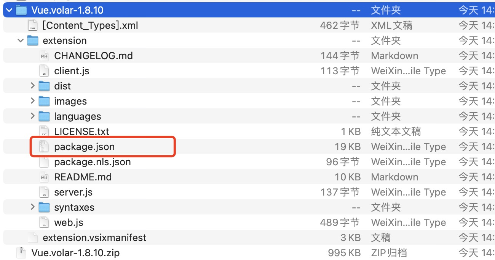
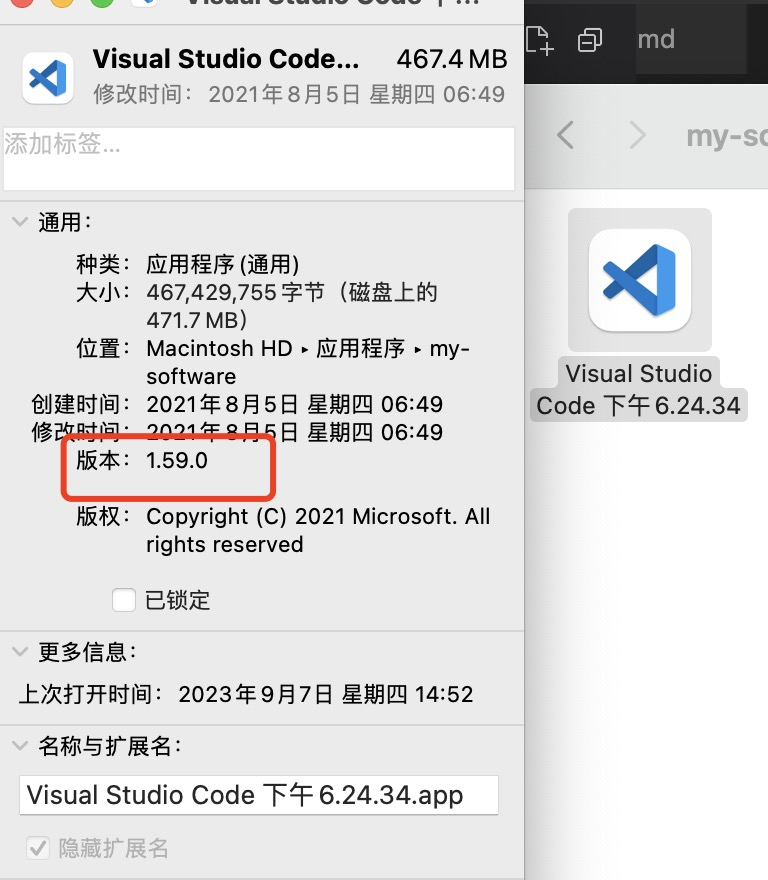

<!--
 * @Author: your name
 * @Date: 2021-08-12 17:30:57
 * @LastEditTime: 2023-09-12 11:19:52
 * @LastEditors: yanglilong
 * @Description: In User Settings Edit
 * @FilePath: /blog/docs/vue/vue3/index.md
-->

## 介绍

#### [vue3 官网](https://v3.cn.vuejs.org/guide/migration/introduction.html)

#### [参考](https://zhuanlan.zhihu.com/p/347557210) [github](https://github.com/ibwei/vue3-ts-base)

#### 目前支持 vue3 的 UI 库

ant-design-vue、element-plus、vant、taro 都已经支持 vue3（注意甄别，部分库有 BUG）

#### 链路库

- Vue Router 4.0 提供了 Vue 3 支持，并有许多突破性的变化

- Vuex 4.0 提供了 Vue 3 支持，其 API 与 3.x 基本相同。唯一的突破性变化是[插件的安装方式](https://next.vuex.vuejs.org/guide/migrating-to-4-0-from-3-x.html#breaking-changes)

## 新增特性

- vue3 对 TS 的支持更友好了，因为重写了 API 支持了 TS 的类型推导系统，vue2 支持 TS 需要用 vue-class-component 来用基于 class 的组件书写方式，装饰器的写法实际上绕了一个弯。

- 全新的构建工具 vite 支持，更快

- 使用新的方案来做状态管理。我们知道，vue3 中的响应式变量 ref/reactive 天生与组件解耦，也就是说，可以在组件外单独声明 ref/reactive，然后再在组件内引用。这样一来，跨组件共享状态的需求在框架内部就得到解决

- 组合式 API ( composition api )

  > 引入 setup 解决复杂组件逻辑分离造成的阅读和维护困难的问题。
  > 在执行 setup 时，组件实例尚未被创建，因此在 setup 选项中没有 this。这意味着，除了 props 之外，你将无法访问组件中声明的任何属性——本地状态、计算属性或方法。

- Teleport

- 片段

- 触发组件选项

- 来自 @vue/runtime-core 的 createRenderer API 创建自定义渲染器

- 还要一些 API 的移除，装饰器的修改，生命周期函数 destroyed（unmounted），beforeDestroy（beforeUnmount）重命名等。

## 快速开始

- 通过脚手架 [vite](https://github.com/vitejs/vite)

```javascript
//注意：git bash 不支持↑↓选择，建议用系统cmd
npm init @vitejs/app hello-vue3

//或者
yarn create @vitejs/app hello-vue3
```

- 通过脚手架 vue-cli
  > 从 v4.5.0 开始，vue-cli 现在提供了内置选项，可在创建新项目时选择 Vue 3。现在可以升级 vue-cli 并运行 vue create 来创建 Vue 3 项目。

```javascript
npm install -g @vue/cli # 或 yarn global add @vue/cli
vue create hello-vue3
# 选择 vue 3 preset
```

## [vite](https://github.com/vitejs/vite)

#### vue3 全新构建工具 vite (总体生态还需完善)

vite 基于浏览器自带 module 去解析 JS，所以比 webpack 打包速度快，热更新也快。

需要注意的是：

- vite 不支持 require 导入模块

- vite 不支持@

- vite 修改端口及支持 https 访问

```js
import { defineConfig } from "vite";
import vue from "@vitejs/plugin-vue";

// https://vitejs.dev/config/
export default defineConfig({
  plugins: [vue()],
  server: {
    port: 8089,
    host: "0.0.0.0",
  },
});
```

## vue3 +ts+vite+piaia 开发问题摘记

1. vue3 Vetur 报错：has no default export 组件没导出

> 经过资料查询是 Vetur(v0.35.0) 暂不支持 ts, 解决办法：

1). 卸载 vetur，更换支持 ts 的语法高亮插件 Volar 以取代 Vetur (推荐此方法)

2). 不用 script setup 语法糖，改用 Options API 写法(不建议)

2. Cannot find module 'pinia'. Did you mean to set the 'moduleResolution' option to 'node', or to add aliases to the 'paths' option?

> 安装 Vue Language Features (Volar)（vue 语言功能 volar）

3. 安装 Vue Language Features (Volar)（vue 语言功能 volar）失败问题？

> 在 macos 下安装失败的解决办法

- 手动下载 volar-1.8.10.vsix

- 修改 Vue.volar-1.8.10.vsix 后缀为 Vue.volar-1.8.10.zip

- 打开压缩文件，修改 extension 下面的 package.json



- 点击 package.json,修改两处 vscode 版本号与电脑 vscode 的版本号保存一致

```js
  "engines": {
		"vscode": "^1.59.0"
	},
  "devDependencies": {
		"@types/vscode": "1.59.0",
	}
```



- 压缩 Vue.volar-1.8.10 为.zip 文件

- 右键，点击显示简介，更改后缀名.vsix

- 在 vscode 手动 vsix 安装--扩展》install from VSIX...

- 如果安装之后遇到未在 zip 中找到扩展名/package.json。先安装 vsce

```js
  npm install -g vsce
```

- 在控制台，打开 Vue.volar-1.8.10 文件夹下的 extension,运行以下代码

```js
  vsce package
```

- 会在 extension 打包生成新的 Vue.volar-1.8.10.vsix,然后在 vscode 手动 vsix 安装即可。（记得安装成功之后重新打开 vscode）

4. 使用 create-vue 初始化 vue3+ts 的项目后一些文件标红报错问题

```js
//在 “tsconfig.app.json” 文件 的"compilerOptions" 选项中添加配置- - -“moduleResolution”: “node”，添加后保存文件
{
  "extends": "@vue/tsconfig/tsconfig.dom.json",
  "include": ["env.d.ts", "src/**/*", "src/**/*.vue"],
  "exclude": ["src/**/__tests__/*"],
  "compilerOptions": {
    "composite": true,
    "baseUrl": ".",
    "paths": {
      "@/*": ["./src/*"]
    },
    "moduleResolution":"node"
  }
}
```

```js
// 在 “tsconfig.node.json” 文件 的"compilerOptions" 选项中添加配置- - -“moduleResolution”: “node”
{
  "extends": "@tsconfig/node18/tsconfig.json",
  "include": [
    "vite.config.*",
    "vitest.config.*",
    "cypress.config.*",
    "nightwatch.conf.*",
    "playwright.config.*"
  ],
  "compilerOptions": {
    "composite": true,
    "module": "ESNext",
    // "moduleResolution": "Bundler",
    "moduleResolution": "node",
    "types": ["node"]
  }
}
```

5. tsconfig 文件报红可以清除 npm 缓存或者删除 node_modules 重新下载即可

6. 引入定义 ts 类型文件报错 SyntaxError: The requested module ‘xxx‘ does not provide an export named ‘xxx‘

> vite 引入 ts 定义数据类型的模块爆出处理方式
> 解决方法： import type { xxx } from 'xxxx'

7. 修改 vite 项目的环境变量
   [csdn](https://blog.csdn.net/qq_34205305/article/details/128937275)

8. 组合式 API (Composition API)和 选项式 API (Options API)？

- 使用选项式 API，我们可以用包含多个选项的对象来描述组件的逻辑，例如 data、methods 和 mounted。选项所定义的属性都会暴露在函数内部的 this 上，它会指向当前的组件实例。

- 通过组合式 API，我们可以使用导入的 API 函数来描述组件逻辑。在单文件组件中，组合式 API 通常会与 script setup 搭配使用。这个 setup attribute 是一个标识，告诉 Vue 需要在编译时进行一些处理，让我们可以更简洁地使用组合式 API。比如，script setup 中的导入和顶层变量/函数都能够在模板中直接使用。

- 选项式 API 以“组件实例”的概念为中心 (即上述例子中的 this)，对于有面向对象语言背景的用户来说，这通常与基于类的心智模型更为一致。同时，它将响应性相关的细节抽象出来，并强制按照选项来组织代码，从而对初学者而言更为友好。

- 组合式 API 的核心思想是直接在函数作用域内定义响应式状态变量，并将从多个函数中得到的状态组合起来处理复杂问题。这种形式更加自由，也需要你对 Vue 的响应式系统有更深的理解才能高效使用。相应的，它的灵活性也使得组织和重用逻辑的模式变得更加强大。

9. 组合式 API 并不是函数式编程。组合式 API 是以 Vue 中数据可变的、细粒度的响应性系统为基础的，而函数式编程通常强调数据不可变。

10. ref 和 reactive 的区别？为啥 reactive 定义的数据在 watch 里面修改了视图不更新？

- ref 支持所有类型，ref 的参数为：基本数据类型/引用数据类型/DOM 的 ref 属性值，如果传入对象，会在 ref 内部调用 reactive
- ref 是赋值操作，reactive 是修改对象里面的部分属性的时候使用
- 实际操作建议全部 ref

```js
ref(0) <=> reactive({value: 0})
```

11. element-plus 国际化改成中文

```js
//在App.vue文件中
<template>
    <el-config-provider :locale="locale">
        <router-view></router-view>  // 根据自己项目情况，把主要内容用el-config-provider包裹
    </el-config-provider>
</template>
<script lang="ts" setup>
import zhCn from 'element-plus/dist/locale/zh-cn.mjs'
const locale = zhCn
</script>

//如果是ts的项目，还需要多一步设置。ts会报element-plus/dist/locale/zh-cn.mjs没有声明，需要在根目录的env.d.ts文件进行声明。
declare module 'element-plus/dist/locale/zh-cn.mjs'
```

12. vuex 和 pinia 的区别？

- pinia 不再支持 module
- pinia 支持响应式数据，对 ts 支持更友好
- pinia 取消 mutation，同步异步操作都在 action 里面
- pinia 简单直接，适合中小型项目（当然大型项目也可以自己去封装 module）

13. vue3 异步请求的数据不更新视图?（主要是对象，数组没问题）

- 通过 v-if 重新渲染
- 监听 props,利用内置函数强制刷新视图 nexttick

```js
//接收父组件的数据
const props: any = defineProps({
  html: String,
  objkey: String,
});
// 内容 HTML
const valueHtml = ref("");
watch(
  () => props,
  (newVal) => {
    if (newVal) {
      nextTick(() => {
        valueHtml.value = newVal.html;
      });
    }
  },
  { immediate: true, deep: true }
);
```

14. vite 跨域问题？
    > 通过代理的方式实现跨域：http://localhost:8080/xinyu/admin/login

- 修改 vite.config.ts

```js
//多域名配置
server: {
    cors: true, // 默认启用并允许任何源
    open: true, // 在服务器启动时自动在浏览器中打开应用程序
    port: 8080,
    proxy: {
      '^/xinyu/admin/': {
        target: 'http://cssuper.beijingliuli.top', //代理接口
        changeOrigin: true
        // rewrite: (path) => path.replace(/^\/api/, '')
      },
      '^/xinyu/': {
        target: 'http://cszxsapi.beijingliuli.top', //代理接口
        changeOrigin: true
      }
    }
  },
```

- 修改.env.dev

```js
#（.env.dev 测试/开发环境变量配置）
VITE_ENV = development

# 资源地址
VITE_SOURCE_URL = http://cssuper.beijingliuli.top

# 文件地址
VITE_FILES_URL = http://csfile.beijingliuli.top

# 基础域名：注意端口号要与vite.config.ts的server部分一致
VITE_BASE_URL = http://localhost:8080
```

15. vite 打包环境问题?

- 跟目录添加 .env.dev

```js
#（.env.dev 开发环境变量配置）
VITE_ENV = development

# 资源地址
VITE_SOURCE_URL = http://cssuper.beijingliuli.top

# 文件地址
VITE_FILES_URL = http://csfile.beijingliuli.top

# 基础域名：注意端口号要与vite.config.ts的server部分一致
VITE_BASE_URL = http://localhost:8080

```

- 跟目录添加 .env.test 文件

```js
#（.env.dev 测试环境变量配置）
VITE_ENV = development

# 资源地址
VITE_SOURCE_URL = http://cssuper.beijingliuli.top

# 文件地址
VITE_FILES_URL = http://csfile.beijingliuli.top

# 基础域名：注意端口号要与vite.config.ts的server部分一致
VITE_BASE_URL = http://csxsuper.beijingliuli.top

```

- 跟目录添加 .env.prod 文件

```js
#（.env.prod 生产环境变量配置）
VITE_ENV = product

# 资源地址
VITE_SOURCE_URL = http://super.beijingliuli.top

# 文件地址
VITE_FILES_URL = http://file.beijingliuli.top

# 基础域名：注意端口号要与vite.config.ts的server部分一致
VITE_BASE_URL = http://super.beijingliuli.top

```

- package.json 修改脚本

```js
  "scripts": {
    "dev": "vite --mode dev",
    "test": "vite --mode test",
    "prod": "vite --mode prod",
    "build": "run-p type-check build-dev",
    "build:test": "run-p type-check build-test",
    "build:prod": "run-p type-check build-prod",
    "build-dev": "vite build --mode dev",
    "build-test": "vite build --mode test",
    "build-prod": "vite build --mode prod",
    "preview": "vite preview",
    "type-check": "vue-tsc --noEmit -p tsconfig.app.json --composite false",
    "lint": "eslint . --ext .vue,.js,.jsx,.cjs,.mjs,.ts,.tsx,.cts,.mts --fix --ignore-path .gitignore",
    "format": "prettier --write src/"
  },
```

- 命令说明

```js
npm run dev/test/prod  //启动开发/测试环境/生产环境

npm run build //打开发环境的包，从.env.dev读取配置

npm run build:test //测试环境的包，从.env.test读取配置

npm run build:prod  //打生产环境的包，从.env.prod读取配置
```

16. vite 项目下引入第三方的镜头资源要放在 public 下
    > public 下的静态资源会自动的被 copy 到 dist 跟目录下
